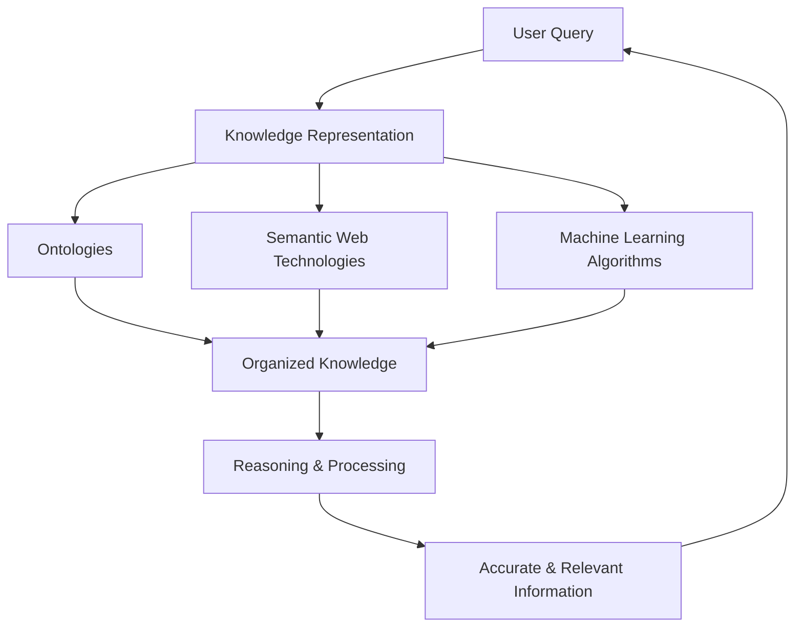
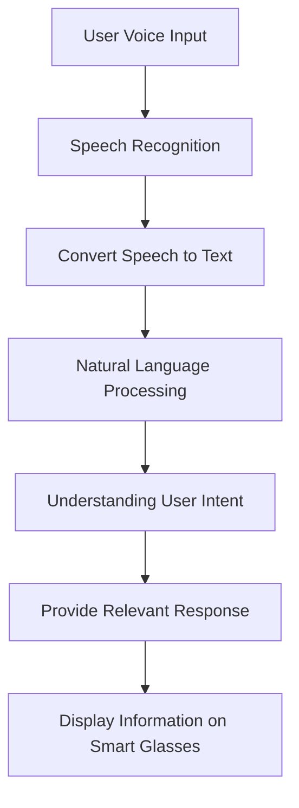
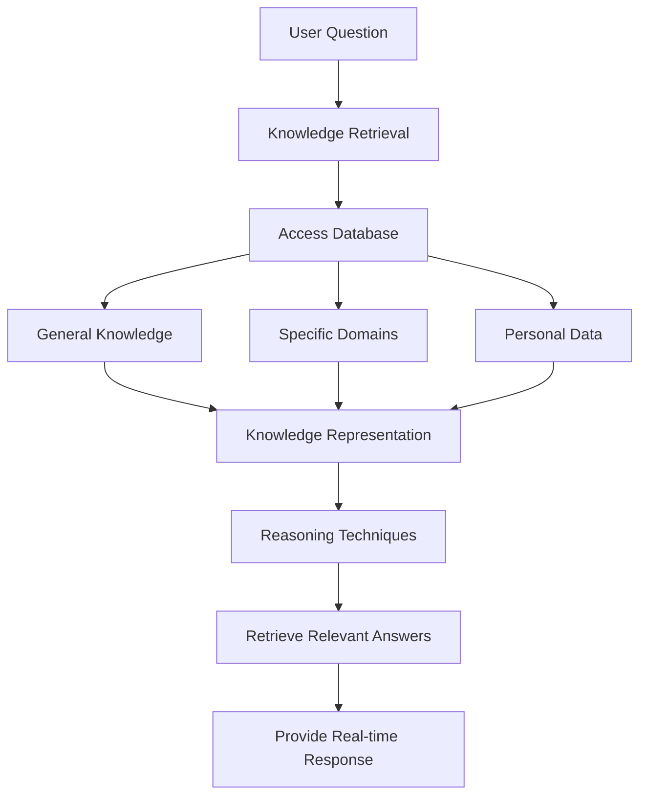
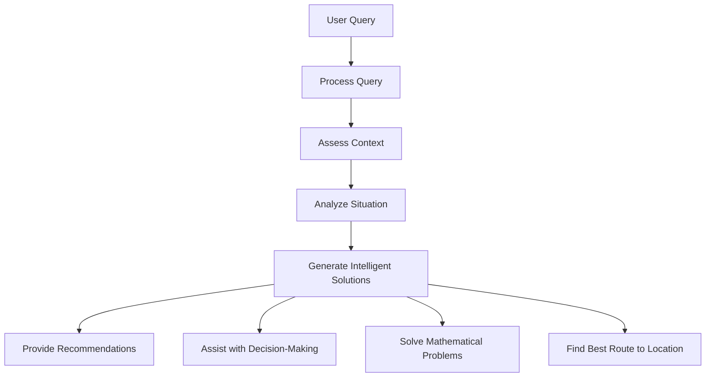

# Assistive Smart Glasses for Empowering Individuals with Disabilities: A Comparative Study of ADA and Oureyes Systems

## Table of Contents

- [Assistive Smart Glasses for Empowering Individuals with Disabilities: A Comparative Study of ADA and Oureyes Systems](#assistive-smart-glasses-for-empowering-individuals-with-disabilities-a-comparative-study-of-ada-and-oureyes-systems)
  - [Table of Contents](#table-of-contents)
  - [I. Introduction](#i-introduction)
    - [A. Background and Significance](#a-background-and-significance)
    - [B. Research Motivation and Objectives](#b-research-motivation-and-objectives)
    - [C. Overview of the Paper Structure](#c-overview-of-the-paper-structure)
  - [II. Introduction to Related Technologies and Products](#ii-introduction-to-related-technologies-and-products)
    - [A. ADA Intelligent Glasses System](#a-ada-intelligent-glasses-system)
    - [B. Oureyes Smart Glasses System](#b-oureyes-smart-glasses-system)
  - [III. Benefits of ADA and Oureyes for Individuals with Disabilities](#iii-benefits-of-ada-and-oureyes-for-individuals-with-disabilities)
    - [A. ADA: Features and Advantages](#a-ada-features-and-advantages)
    - [B. Oureyes: Features and Advantages](#b-oureyes-features-and-advantages)
  - [IV. Use Cases and Practical Applications](#iv-use-cases-and-practical-applications)
    - [A. Everyday Applications of ADA](#a-everyday-applications-of-ada)
    - [B. Everyday Applications of Oureyes](#b-everyday-applications-of-oureyes)
  - [V. Evaluation and Discussion](#v-evaluation-and-discussion)
    - [A. Assessment of Functionality, Performance, and Feasibility](#a-assessment-of-functionality-performance-and-feasibility)
    - [B. User Feedback and Opinions](#b-user-feedback-and-opinions)
    - [C. Challenges and Limitations](#c-challenges-and-limitations)
    - [D. Privacy and Security Concerns](#d-privacy-and-security-concerns)
  - [VI. Conclusion and Future Outlook](#vi-conclusion-and-future-outlook)
    - [A. Summary of Key Findings](#a-summary-of-key-findings)
    - [B. Future Development Directions](#b-future-development-directions)
    - [C. Impact and Value on the Lives of Individuals with Disabilities](#c-impact-and-value-on-the-lives-of-individuals-with-disabilities)
  - [VII. References](#vii-references)

## I. Introduction 

### A. Background and Significance

The introduction section provides an overview of the background and significance of the research topic. It highlights the increasing importance of assistive technologies for individuals with disabilities and the role of smart glasses in improving their daily lives. It may discuss the challenges faced by individuals with disabilities and how smart glasses systems can address these challenges. Additionally, it may mention the growing interest and advancements in the field of assistive smart glasses. 

### B. Research Motivation and Objectives

This subsection explains the motivation behind conducting the research and identifies the specific objectives of the study. It may discuss the need for a comparative analysis of ADA and Oureyes systems to understand their respective capabilities and benefits for individuals with disabilities. The subsection may also mention the potential impact of the research on improving the lives of individuals with disabilities and the broader field of assistive technologies.

### C. Overview of the Paper Structure

The overview of the paper structure provides a brief outline of the main sections and topics covered in the paper. It serves as a roadmap for readers, guiding them through the organization and flow of information. The subsection may mention the major sections such as Related Technologies and Products, Benefits of ADA and Oureyes, Use Cases and Practical Applications, Evaluation and Discussion, and Conclusion and Future 
Outlook. It helps readers understand the logical progression of the paper and what to expect in each section.

## II. Introduction to Related Technologies and Products

### A. ADA Intelligent Glasses System

The ADA Intelligent Glasses System is a cutting-edge technology designed to provide comprehensive assistance to individuals with disabilities. This subsection focuses on the key features and functionalities of the ADA system. 

1. Knowledge Representation and Reasoning Techniques The ADA system leverages advanced knowledge representation and reasoning techniques to process and understand user queries effectively. It utilizes ontologies, semantic web technologies, and machine learning algorithms to organize and represent knowledge in a structured manner. This enables the system to provide accurate and relevant information to users.
  

Figure 1: Flowchart of Knowledge Representation and Reasoning Techniques

2. Speech-to-Text Functionality
The ADA system incorporates speech recognition technology to convert spoken language into text. This feature allows users to interact with the system using natural language and voice commands. The system's speech-to-text functionality enables seamless communication and interaction between users and the smart glasses.

Figure 2: Flowchart of Speech-to-Text Functionality

3. Knowledge Retrieval and Answer Provision 
ADA's knowledge retrieval capabilities enable users to ask questions and receive prompt and accurate responses. The system can access a vast database of information, including general knowledge, specific domains, and personal data. By leveraging its knowledge representation and reasoning techniques, ADA can retrieve relevant answers and deliver them to users in real-time. 

Figure 3: Flowchart of Knowledge Retrieval and Answer Provision

4. Reasoning and Problem-Solving Solutions 
ADA's reasoning and problem-solving capabilities enable it to analyze complex situations and provide intelligent solutions. The system can process user queries, assess the context, and generate appropriate responses or recommendations. Whether it's finding the best route to a location, solving a mathematical problem, or assisting with decision-making, ADA's reasoning abilities enhance its assistance to users.

Figure 4: Flowchart of Reasoning and Problem-Solving Solutions

5. Intelligent Assistant Features 
The ADA system functions as an intelligent assistant, offering various features to support users in their daily activities. It can set reminders, manage schedules, and provide notifications to help users stay organized. Additionally, ADA can assist with tasks such as reading texts, recognizing objects or faces, and providing navigation guidance, enhancing users' independence and accessibility. 

### B. Oureyes Smart Glasses System

The Oureyes Smart Glasses System is a state-of-the-art technology that focuses on enhancing visual assistance and communication support for individuals with disabilities. This subsection highlights the key features and functionalities of the Oureyes system. 

1. M2 Max Chip and Cameras 
The Oureyes system is equipped with the powerful M2 Max(Intel Core i9-13900K, Or other alternatives)chip, which enables efficient processing and analysis of visual data. The cameras integrated into the smart glasses capture high-resolution images and videos, providing a comprehensive visual input to the system. The M2 Max chip ensures smooth and real-time processing of visual information, facilitating a seamless user experience.

2. Stereo Vision and Depth Perception Techniques 
One of the key strengths of the Oureyes system is its ability to perceive depth and provide a sense of three-dimensional vision. By employing stereo vision techniques, the system can calculate the distance and relative positions of objects in the environment. This depth perception capability enhances the user's spatial awareness, making it easier to navigate and interact with the surroundings. 

3. Audio Output and Bluetooth Connectivity Features 
The Oureyes system incorporates audio output capabilities to deliver information and 
instructions to the user. It can convert text or visual information into audio cues, which 
can be relayed through built-in speakers or connected earphones. This feature enables 
individuals with visual impairments to receive auditory feedback and instructions. 

Additionally, the Oureyes system supports Bluetooth connectivity, allowing users to connect external devices such as earphones, speakers, or other compatible devices. This expands the system's functionality and enables seamless integration with other assistive technologies, such as hearing aids or Braille displays.

## III. Benefits of ADA and Oureyes for Individuals with Disabilities

### A. ADA: Features and Advantages 

1. Knowledge Consultation and Problem-Solving 
The ADA system's knowledge consultation feature empowers individuals with disabilities by providing them with access to a vast pool of information and expertise. Users can ask questions, seek explanations, or request assistance on various topics. This feature enables individuals to expand their knowledge, enhance learning opportunities, and overcome information barriers they might face due to their disabilities. Additionally,  ADA's problem-solving solutions help users tackle complex challenges by providing intelligent recommendations and solutions based on their specific needs and circumstances.

2. Intelligent Assistant Capabilities 
ADA's intelligent assistant features offer significant advantages to individuals with disabilities. The system can set reminders, manage schedules, and provide notifications, helping users stay organized and on track. For individuals with memory or cognitive impairments, ADA serves as a reliable cognitive aid, assisting with tasks such as remembering appointments, deadlines, or medication schedules. The intelligent assistant capabilities of ADA enhance independence and productivity, allowing users to effectively manage their daily lives.

3. Life and Work Management 
ADA's features extend beyond knowledge consultation and intelligent assistance, supporting users in various aspects of life and work. The system can provide guidance and support in vocational settings, aiding individuals with disabilities in their professional endeavors. ADA can offer information on job opportunities, assist with resume writing, and even provide real-time assistance during work tasks. Furthermore, ADA's life management capabilities help users with personal tasks such as managing finances, making reservations, or accessing transportation services. By streamlining these processes, ADA promotes autonomy and inclusion.

### B. Oureyes: Features and Advantages 

1. Visual Assistance Functionality 
The Oureyes system offers advanced visual assistance functionality, benefiting individuals with visual impairments or other visual disabilities. By leveraging its high-resolution cameras and powerful processing capabilities, Oureyes can provide real-time visual feedback and assistance. It can identify objects, recognize text, and offer audio descriptions of the surroundings, enabling users to navigate and interact with their environment more effectively. This visual assistance feature enhances independence, safety, and overall quality of life for individuals with visual impairments.

2. Communication Support 
Oureyes enhances communication for individuals with disabilities, particularly those who have difficulty with spoken or written language. The system's visual recognition capabilities can interpret facial expressions, gestures, and sign language, facilitating non-verbal communication. Oureyes can translate these visual cues into text or audio output, enabling seamless communication between individuals with disabilities and others. This feature promotes inclusivity, social interaction, and greater participation in various social and professional settings. 

3. Bluetooth Connectivity and Expansion Capabilities 
Oureyes' Bluetooth connectivity feature allows users to connect external devices, opening up a world of expanded functionality and compatibility. Users can connect compatible devices such as earphones, speakers, or Braille displays to enhance their experience further. For example, individuals with hearing impairments can connect hearing aids or cochlear implants to receive audio cues directly. Similarly, individuals with visual impairments can connect Braille displays to receive tactile feedback. Bluetooth connectivity broadens the possibilities for customization and personalization, catering to the unique needs of individuals with disabilities.

## IV. Use Cases and Practical Applications

### A. Everyday Applications of ADA

1. Knowledge Retrieval and Question Answering 
ADA's knowledge retrieval and question answering capabilities have numerous everyday applications. Individuals with disabilities can use ADA to quickly access information on a wide range of topics, such as weather forecasts, news updates, or general knowledge inquiries. Whether it's settling a trivia debate with friends, looking up a recipe, or getting information about local events, ADA's knowledge consultation feature makes information readily accessible to users with just a simple query.

2. Event Reminders and Management 
ADA's event reminder and management features provide valuable support in organizing and keeping track of daily activities. Users can input important events, appointments, or deadlines into the system, and ADA will send reminders and notifications at appropriate times. This functionality is particularly useful for individuals with memory impairments or cognitive disabilities, as it helps them stay organized, manage their time effectively, and ensure they don't miss important engagements.

3. Health Management and Medication Reminders 
ADA plays a crucial role in assisting individuals with disabilities in managing their health and medications. The system can send reminders to take medications at specific times, ensuring adherence to prescribed regimens. ADA can also provide information on medications, potential side effects, or interactions, empowering users to make informed decisions about their healthcare. Additionally, ADA can assist with tracking health-related data, such as blood pressure or glucose levels, helping users monitor their well-eing and share relevant information with healthcare providers.

### B. Everyday Applications of Oureyes

1. Environmental Perception and Navigation 
Oureyes' environmental perception capabilities have practical applications in everyday life. Individuals with visual impairments can use Oureyes to navigate unfamiliar environments more confidently. The system can detect and identify obstacles, stairs, or other potential hazards, providing real-time audio feedback to the user. This feature enhances safety and mobility, allowing individuals to independently navigate indoor and outdoor spaces with greater ease.

2. Language Communication and Social Interaction 
Oureyes facilitates language communication and social interaction for individuals with disabilities. The system's ability to interpret facial expressions, gestures, and sign language can bridge communication gaps. Oureyes can convert these visual cues into text or audio output, enabling individuals with communication difficulties to express themselves effectively. This feature promotes inclusivity, facilitates social interactions, and fosters better understanding and connection with others.

3. Expansion Capabilities and Bluetooth Connectivity 
Oureyes' expansion capabilities, combined with Bluetooth connectivity, offer a wide range of practical applications. Users can connect compatible external devices such as earphones, speakers, or Braille displays to customize their experience. For example, individuals with hearing impairments can connect hearing aids or cochlear implants to receive audio cues directly. Similarly, individuals with visual impairments can connect Braille displays to receive tactile feedback. This flexibility allows users to tailor Oureyes to their specific needs and preferences, enhancing their overall experience and accessibility.

## V. Evaluation and Discussion

### A. Assessment of Functionality, Performance, and Feasibility

When evaluating the functionality, performance, and feasibility of the ADA and Oureyes systems, several factors should be considered. These include the reliability and accuracy of the systems' features, the user interface and ease of use, the processing speed and efficiency, and the overall feasibility of implementing the systems in real-world settings. Conducting rigorous testing and performance evaluations can provide valuable insights into these aspects, helping determine the systems' effectiveness and practicality for individuals with disabilities.

### B. User Feedback and Opinions

Collecting user feedback and opinions is crucial for understanding the impact and usability of ADA and Oureyes. User surveys, interviews, and focus groups can provide valuable insights into users' experiences, satisfaction levels, and suggestions for improvement. Analyzing user feedback can help identify strengths and weaknesses of the systems, highlight specific features that are highly valued by users, and guide future development and enhancement efforts.

### C. Challenges and Limitations

It's essential to acknowledge and discuss the challenges and limitations associated with ADA and Oureyes. These may include technical limitations, such as occasional inaccuracies in recognition or processing, limitations in certain environments or lighting conditions, or potential hardware constraints. Additionally, external factors such as user adaptation to the systems, acceptance by society, and issues related to accessibility regulations and policies should be considered. Identifying and addressing these challenges can lead to further improvements and advancements in the systems.

### D. Privacy and Security Concerns 

Privacy and security concerns are critical when evaluating and discussing ADA and Oureyes. As these systems involve the collection and processing of personal data, it is important to ensure robust privacy measures, data protection, and secure storage practices. Discussions should include topics such as data encryption, user consent, anonymization techniques, and adherence to relevant privacy regulations. Addressing privacy and security concerns is essential for fostering trust among users and ensuring the responsible use of these technologies.

## VI. Conclusion and Future Outlook

### A. Summary of Key Findings

In conclusion, the evaluation of ADA and Oureyes reveals several key findings. Both systems offer unique features and advantages that significantly benefit individuals with disabilities in various aspects of their lives. ADA's knowledge consultation, problem-solving, intelligent assistant, and life management capabilities empower users by providing access to information, enhancing productivity, and promoting independence. Oureyes' visual assistance, communication support, and expansion capabilities improve environmental perception, facilitate communication, and customize experiences for individuals with disabilities. 

User feedback and opinions play a crucial role in understanding the effectiveness and usability of both systems. User satisfaction, suggestions for improvement, and identification of specific features valued by users help guide future development and enhancement efforts. It is important to address challenges and limitations, such as technical constraints and privacy concerns, to ensure the continued improvement and responsible use of ADA and Oureyes.

### B. Future Development Directions

The future development of ADA and Oureyes holds promising possibilities. Advancements in natural language processing and machine learning techniques can further enhance ADA's knowledge consultation and problem-solving capabilities. The intelligent assistant feature can be expanded to provide personalized recommendations and adaptive support based on user preferences and needs. Additionally, integrating ADA with emerging technologies, such as augmented reality or virtual reality, can create immersive learning and problem-solving experiences for individuals with disabilities. 

For Oureyes, ongoing research and development can focus on improving the accuracy and robustness of visual recognition algorithms. Further advancements in communication support can include the ability to interpret and translate more complex sign languages or gestures. Expanding the system's compatibility and integration capabilities with a wider range of external devices can further enhance customization and meet diverse user needs. 

### C. Impact and Value on the Lives of Individuals with Disabilities

The impact and value of ADA and Oureyes on the lives of individuals with disabilities are significant. These systems empower users by providing access to information, enhancing communication, promoting independence, and improving overall well-being. By addressing information barriers, facilitating navigation and communication, and offering personalized assistance, ADA and Oureyes contribute to the social inclusion and participation of individuals with disabilities. 

The benefits of ADA and Oureyes extend beyond individual users and also impact society as a whole. By promoting accessibility, inclusivity, and equal opportunities, these systems foster a more inclusive and accommodating environment for individuals with disabilities. They contribute to breaking down barriers and creating a society where everyone can actively participate and thrive.

## VII. References

1. Gamage, Bhanuka. (2024). "AI-Enabled Smart Glasses for People with Severe Vision Impairments." *ACM SIGACCESS Accessibility and Computing*, 1-1. DOI: [10.1145/3654768.3654771](https://doi.org/10.1145/3654768.3654771)

2. Nazim, S., Firdous, S., Pillai, S. R., & Shukla, V. K. (2022). "Smart Glasses: A Visual Assistant for the Blind." In *2022 International Mobile and Embedded Technology Conference (MECON)*, pp. 621-626. DOI: [10.1109/MECON53876.2022.9751975](https://doi.org/10.1109/MECON53876.2022.9751975)

3. Ruffieux, S., Hwang, C., Junod, V., et al. (2023). "Tailoring assistive smart glasses according to pathologies of visually impaired individuals: an exploratory investigation on social needs and difficulties experienced by visually impaired individuals." *Univ Access Inf Soc*, 22, 463–475. DOI: [10.1007/s10209-021-00857-5](https://doi.org/10.1007/s10209-021-00857-5)