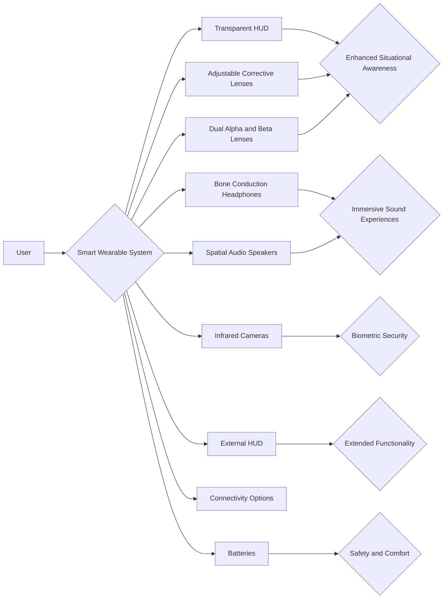

# Project Mountain Lion Innovation Proposal

## Table of Contents

- [Project Mountain Lion Innovation Proposal](#project-mountain-lion-innovation-proposal)
  - [Table of Contents](#table-of-contents)
  - [Overview](#overview)
  - [Innovation](#innovation)
  - [Application Scope](#application-scope)
  - [Implementation Approach](#implementation-approach)
  - [Hardware](#hardware)
  - [Software](#software)
  - [Other Considerations](#other-considerations)
  - [Blueprint](#blueprint)
  - [Tech Spec](#tech-spec)

## Overview

The Mountain Lion Project introduces an advanced smart wearable system designed to redefine user experiences. Featuring a custom lightweight operating system built on the Linux kernel, this system is optimized for wearables, ensuring efficiency, stability, and scalability. With a range of cutting-edge features such as a transparent HUD, adjustable corrective lenses, dual Alpha and Beta lenses, bone conduction headphones, spatial audio speakers, infrared cameras, an external HUD, and seamless connectivity options, this system pushes the boundaries of wearable technology.

## Innovation

A standout innovation of the Mountain Lion Project is the transparent HUD, which superimposes high-resolution visuals onto the user's field of vision while maintaining transparency, enhancing situational awareness. The system's capability to tailor projection clarity through corrective lenses ensures optimal visual experiences. Additionally, the integration of bone conduction headphones and spatial audio speakers delivers immersive sound experiences without compromising ambient sound awareness.

## Application Scope

The Mountain Lion Project smart wearable system caters to a wide array of applications, including augmented reality, 3D visualization, depth sensing, eye-tracking, iris recognition, navigation assistance, virtual guidance, and obstacle detection. These applications enhance user perception, safety, and interactivity across various scenarios, from everyday activities to specialized professional uses.

## Implementation Approach

The system is implemented using ARM 64 architecture and a lightweight Linux-based operating system. Laser radar and camera scanning functionalities are integrated to provide real-time depth perception, object identification, and obstacle recognition. Intelligent algorithms process this data to offer navigation assistance, virtual guidance, and safety alerts, enhancing user safety and situational awareness.

## Hardware

Key hardware components include a transparent HUD, support for corrective lenses, dual Alpha and Beta lenses for wide-angle and depth sensing, bone conduction headphones, spatial audio speakers, infrared cameras for biometric security, an external HUD for extended functionality, diverse connectivity options, and evenly distributed batteries for safety and comfort.

## Software

The custom lightweight operating system based on the Linux kernel ensures rapid response times and a seamless user experience. Tailored for wearables, this OS enables efficient operation and seamless integration of features like augmented reality, 3D visualization, eye-tracking, and obstacle recognition, enhancing user interaction and functionality.

## Other Considerations

The Mountain Lion Project emphasizes user comfort, safety, and convenience with features such as wireless charging, advanced biometric security, immersive sound experiences, and real-time environmental perception. By combining advanced hardware components with intelligent software algorithms, this smart wearable system sets a new standard in wearable technology, providing users with a rich, convenient, and secure experience.

## Blueprint

[Project Mountain Lion v0.5](media/PML0_5.pdf)
[Project Mountain Lion v1.0](media/PML1_0.pdf)

## Tech Spec

- LiDAR: TFmini-S Lidar Ranging Sensor, 12m Ranging Distance, Low Power, High Frame Rate, Compact Size and Easy to integrate, 42 × 15 × 16mm
- Camera: UCAM-III-76LENS, 32mm x 32mm x 21mm (without lens, including header)
- Bone Conduction Headphones: PHILIPS H4205 Bone Conduction Headphones, 3.78 x 5.51 x 2.17 inches
- Screen: OLED Ultra 4K Displays

- Author: Carson Wu
- Document Identification Code: 20240827_04
- The development timeline: 2016 - Present
