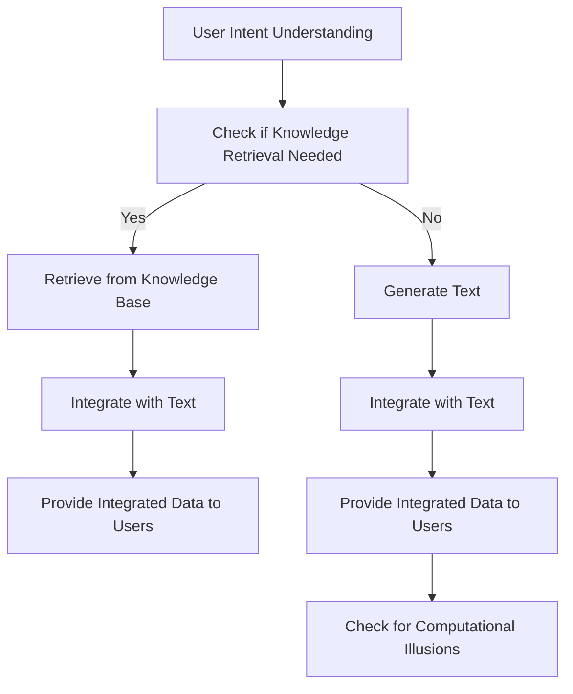

# A.R.I.E.L. 2.0

## Table of Contents

- [A.R.I.E.L. 2.0](#ariel-20)
  - [Table of Contents](#table-of-contents)
  - [Introduction](#introduction)
  - [Workflow](#workflow)

## Introduction

A.R.I.E.L. (Advanced Retrieval and Inference Engine for Learning) is a generative model based on a retrieval mechanism designed to enhance the performance of generative models in text generation tasks. Here is a detailed explanation of how A.R.I.E.L. operates:

1. **Retrieval-based Approach:**
   - A.R.I.E.L. incorporates a retrieval-based approach into generative models. This means that before generating text, it retrieves relevant information from a large knowledge base.

2. **Retriever:**
   - A.R.I.E.L. includes a retriever that retrieves relevant information from a structured knowledge base based on input prompts or tasks.

3. **Generator:**
   - The generator is responsible for generating the final text output based on the retrieved information and input prompts.

4. **Integration of Retrieval and Generation:**
   - By combining retrieved information with the generative model, A.R.I.E.L. enhances the content consistency and accuracy of generated text. The retrieved information can be used as part of the generator to guide the generation process.

5. **Pre-training and Fine-tuning:**
   - A.R.I.E.L. models typically use pre-trained retrievers and generators, followed by fine-tuning on specific tasks to improve performance.

6. **Applications:**
   - A.R.I.E.L. has potential applications in various natural language processing tasks such as question-answering systems, dialogue systems, and text generation, especially when external knowledge bases are required to generate text with content and logic.

In summary, A.R.I.E.L. leverages retrieved information to guide the generation process, thereby enhancing the performance and effectiveness of generative models in various natural language processing tasks. This combination of retrieval and generation allows the model to better handle text generation tasks that require external knowledge.

## Workflow

- Author: Carson Wu
- Document Identification Code: 20240905_01
- The development timeline: 2016 - Present
