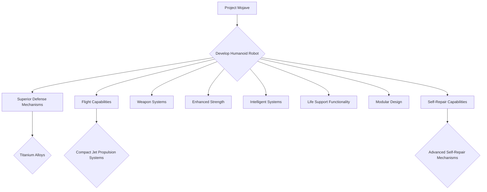

# Project Mojave

- [Project Mojave](#project-mojave)
  - [Introduction](#introduction)
  - [Overview](#overview)
  - [Innovation](#innovation)
  - [Application Scope](#application-scope)
  - [Implementation Approach](#implementation-approach)
  - [Other Considerations](#other-considerations)
  - [Blueprint](#blueprint)
  - [Workflow](#workflow)

## Introduction

Project Mojave aims to develop a humanoid robot capable of human-like activities. The ultimate goal is to reduce the cost of the armor, as depicted in Iron Man, and enable mass production.

## Overview

The project focuses on creating a humanoid robot with advanced capabilities similar to those of the Iron Man armor. It aims to achieve superior defense mechanisms, flight capabilities, weapon systems, enhanced strength, intelligent systems, life support functionality, modular design, and self-repair capabilities.

## Innovation

The innovative aspects of Project Mojave include the integration of high-strength materials like titanium alloys for superior defense, compact jet propulsion systems based on large fuel cell propulsion technology for flight, and advanced self-repair mechanisms utilizing enhanced particle interactions for automatic component restoration.

## Application Scope

The humanoid robot developed through Project Mojave is intended for a wide range of applications, including defense, disaster response, exploration, and various industries requiring advanced robotic assistance.

## Implementation Approach

The implementation approach of Project Mojave involves the meticulous design and engineering of the humanoid robot, incorporating state-of-the-art materials, propulsion systems, weapon technologies, and intelligent AI systems. The modular design allows for customization and quick adaptation to different mission requirements.

## Other Considerations

As Project Mojave progresses, considerations such as energy efficiency, cost-effectiveness, scalability for mass production, user interface design, and ethical implications of advanced autonomous systems will be key areas of focus for the project team.

## Blueprint

[Project Mojave v0.5](media/PM0_5.pdf)
[Project Mojave v1.0](media/PM1_0.pdf)
~~[Project Mojave v2.0](media/PM2_0.pdf)~~

## Workflow

## Document Data

- Author: Carson Wu
- Document Identification Code: 20240906_01
- The development timeline: 2016 - Present
