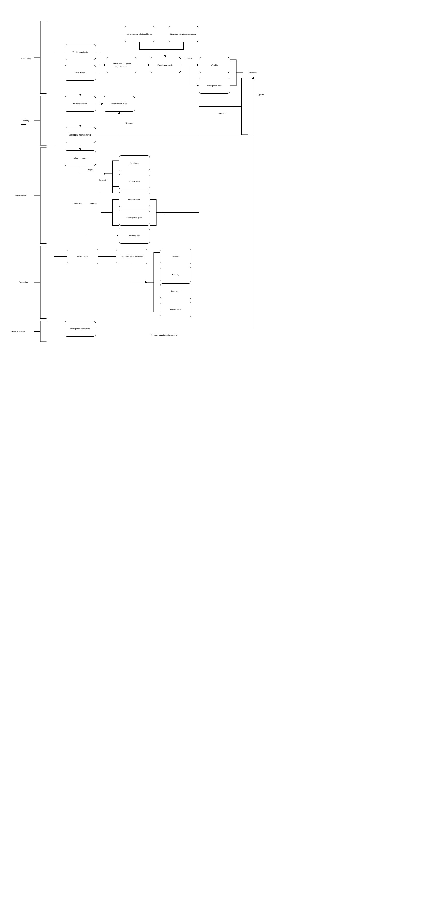
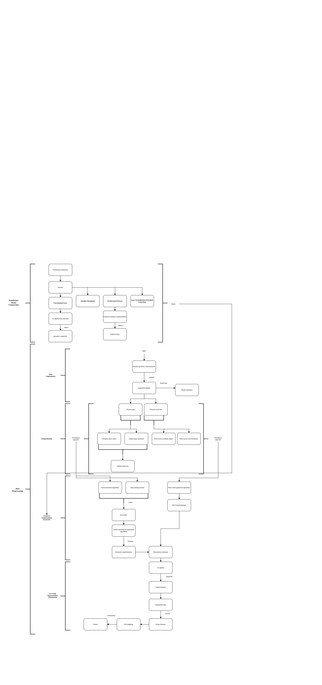

# Lie Equivariant Perception Algebraic Unified Transform Embedding Framework (L.E.P.A.U.T.E. Framework): Achieving Precise Modeling of Geometric Transformations

In computer vision, geometric transformation modeling in images accurately has been a significant challenge. While traditional Convolutional Neural Networks(CNN) are extremely competent at most vision tasks, they usually do not have geometric transformation modeling explicitly. To resolve this issue, a Lie group-based vision modeling framework is proposed. By using the Lie group theory to image representations, this model represents the algebraic structure of geometric transformations directly, enabling intrinsic modeling of transformations such as rotation, translation, and scaling.

## I. Table of Contents

- [Lie Equivariant Perception Algebraic Unified Transform Embedding Framework (L.E.P.A.U.T.E. Framework): Achieving Precise Modeling of Geometric Transformations](#lie-equivariant-perception-algebraic-unified-transform-embedding-framework-lepaute-framework-achieving-precise-modeling-of-geometric-transformations)
  - [I. Table of Contents](#i-table-of-contents)
  - [II. Current State of the Field](#ii-current-state-of-the-field)
  - [III. Framework Definition](#iii-framework-definition)
    - [1. Lie Group Representation](#1-lie-group-representation)
      - [1.1 Lie Group Manifold Definition](#11-lie-group-manifold-definition)
      - [1.2 Algebraic Structure Encoding](#12-algebraic-structure-encoding)
    - [2. Neural Network Architecture](#2-neural-network-architecture)
      - [2.1 Lie Group Convolutional Layer](#21-lie-group-convolutional-layer)
      - [2.2 Lie Group Attention Mechanism](#22-lie-group-attention-mechanism)
    - [3. Loss Functions and Training](#3-loss-functions-and-training)
      - [3.1 Geometric Invariance Loss Function](#31-geometric-invariance-loss-function)
      - [3.2 Unsupervised and Self-Supervised Learning](#32-unsupervised-and-self-supervised-learning)
      - [3.3 Optimization](#33-optimization)
  - [IV. Theoretical Examples\[^8\]](#iv-theoretical-examples8)
      - [1. Lie Group Representation](#1-lie-group-representation-1)
      - [2. Neural Network Design](#2-neural-network-design)
      - [3. Training and Optimization](#3-training-and-optimization)
    - [4. Additional Considerations](#4-additional-considerations)
  - [V. Principles and Implementation](#v-principles-and-implementation)
    - [1. Data Representation Transformation](#1-data-representation-transformation)
      - [1.1 Principles](#11-principles)
      - [1.2 Operational Steps](#12-operational-steps)
      - [1.3 Implementation Details](#13-implementation-details)
    - [2. Transformer Architecture Design](#2-transformer-architecture-design)
      - [2.1 Principles](#21-principles)
      - [2.2 Operational Steps](#22-operational-steps)
      - [2.3 Implementation Details](#23-implementation-details)
    - [3. Lie Group Convolutional Layer](#3-lie-group-convolutional-layer)
      - [3.1 Principles](#31-principles)
      - [3.2 Operational Steps](#32-operational-steps)
      - [3.3 Implementation Details](#33-implementation-details)
    - [4. Lie Group Attention Mechanism](#4-lie-group-attention-mechanism)
      - [4.1 Principles](#41-principles)
      - [4.2 Operational Steps](#42-operational-steps)
      - [4.3 Implementation Details](#43-implementation-details)
    - [5. Training and Optimization](#5-training-and-optimization)
      - [5.1 Principles](#51-principles)
      - [5.2 Operational Steps](#52-operational-steps)
      - [5.3 Implementation Details](#53-implementation-details)
    - [6. Additional Considerations](#6-additional-considerations)
      - [6.1 Computational Efficiency Optimization](#61-computational-efficiency-optimization)
      - [6.2 Scalability](#62-scalability)
      - [6.3 Practical Applications](#63-practical-applications)
      - [6.4 Challenges and Solutions](#64-challenges-and-solutions)
  - [VI. Implementation Process](#vi-implementation-process)
    - [1. Data Preprocessing](#1-data-preprocessing)
      - [1.1 Principles](#11-principles-1)
      - [1.2 Key Considerations](#12-key-considerations)
      - [1.2 Operational Steps](#12-operational-steps-1)
      - [1.3 Implementation Details](#13-implementation-details-1)
    - [2. Transformer Model Construction\[^9\]](#2-transformer-model-construction9)
      - [2.1 Principles](#21-principles-1)
      - [2.2 Operational Steps](#22-operational-steps-1)
      - [2.3 Implementation Details](#23-implementation-details-1)
    - [3. Model Training](#3-model-training)
      - [3.1 Principles](#31-principles-1)
      - [3.2 Operational Steps](#32-operational-steps-1)
      - [3.3 Implementation Details](#33-implementation-details-1)
    - [4. Model Evaluation](#4-model-evaluation)
      - [4.1 Principles](#41-principles-1)
      - [4.2 Operational Steps](#42-operational-steps-1)
      - [4.3 Implementation Details](#43-implementation-details-1)
    - [5. Application Scenarios](#5-application-scenarios)
      - [5.1 Principles](#51-principles-1)
      - [5.2 Operational Steps](#52-operational-steps-1)
      - [5.3 Implementation Details](#53-implementation-details-1)
    - [6. Additional Considerations](#6-additional-considerations-1)
      - [6.1 Computational Efficiency](#61-computational-efficiency)
      - [6.2 Scalability](#62-scalability-1)
      - [6.3 Potential Issues and Solutions](#63-potential-issues-and-solutions)
  - [VII. Impact Analysis](#vii-impact-analysis)
    - [1. Differences](#1-differences)
      - [1.1 Data-Driven Methods vs. Geometric Structure Modeling](#11-data-driven-methods-vs-geometric-structure-modeling)
      - [1.2 Geometric Transformation Modeling](#12-geometric-transformation-modeling)
      - [1.3 Other Differences](#13-other-differences)
    - [2. Advantages](#2-advantages)
      - [2.1 Geometric Invariance](#21-geometric-invariance)
      - [2.2 Precise Modeling](#22-precise-modeling)
      - [2.3 Other Advantages](#23-other-advantages)
    - [3. Limitations](#3-limitations)
      - [3.1 Complexity](#31-complexity)
      - [3.2 Data Requirements](#32-data-requirements)
      - [3.3 Other Limitations](#33-other-limitations)
      - [4. Comparison with Existing Methods](#4-comparison-with-existing-methods)
      - [5. Considerations for Real-World Applications](#5-considerations-for-real-world-applications)
      - [6. Future Improvements](#6-future-improvements)
  - [VIII. Practical Implementation](#viii-practical-implementation)
    - [1. 3D Reconstruction and Geometric Modeling](#1-3d-reconstruction-and-geometric-modeling)
      - [1.1 Application Background](#11-application-background)
      - [1.2 Practical Implementation](#12-practical-implementation)
      - [1.3 Challenges and Solutions](#13-challenges-and-solutions)
      - [1.4 Case Studies\[^2\]](#14-case-studies2)
    - [2. Robotic Navigation and SLAM](#2-robotic-navigation-and-slam)
      - [2.1 Application Background](#21-application-background)
      - [2.2 Practical Implementation](#22-practical-implementation)
      - [2.3 Challenges and Solutions](#23-challenges-and-solutions)
      - [2.4 Case Studies](#24-case-studies)
    - [3. Medical Image Processing](#3-medical-image-processing)
      - [3.1 Application Background](#31-application-background)
      - [3.2 Practical Implementation](#32-practical-implementation)
      - [3.3 Challenges and Solutions](#33-challenges-and-solutions)
      - [3.4 Case Studies](#34-case-studies)
    - [4. Visual Localization and Scene Understanding](#4-visual-localization-and-scene-understanding)
      - [4.1 Application Background](#41-application-background)
      - [4.2 Practical Implementation](#42-practical-implementation)
      - [4.3 Challenges and Solutions](#43-challenges-and-solutions)
      - [4.4 Case Studies\[^5\]](#44-case-studies5)
    - [5. Autonomous Driving and UAVs](#5-autonomous-driving-and-uavs)
      - [5.1 Application Background](#51-application-background)
      - [5.2 Practical Implementation](#52-practical-implementation)
      - [5.3 Challenges and Solutions](#53-challenges-and-solutions)
      - [5.4 Case Studies\[^7\]](#54-case-studies7)
    - [6. Additional Considerations](#6-additional-considerations-2)
      - [6.1 Technical Optimization](#61-technical-optimization)
      - [6.2 Tools and Ecosystem](#62-tools-and-ecosystem)
      - [6.3 Challenges and Solutions](#63-challenges-and-solutions)
      - [6.4 Future Directions](#64-future-directions)
  - [IX. Workflow Chart](#ix-workflow-chart)
  - [X. Conclusion](#x-conclusion)
  - [XI. References](#xi-references)
  - [XI. Footnote](#xi-footnote)

## II. Current State of the Field

The L.E.P.A.U.T.E. Framework, as an state-of the-art technology in computer vision, provides a whole new solutions for handling complex visual tasks by explicitly modeling geometric transformations (e.g., rotation, translation, scaling). This framework is gradually transitioning from academic research to experimental applications in reality, particularly in fields requiring high-precision geometric modeling, such as 3D reconstruction, robotic navigation, medical image processing, visual localization, and autonomous driving. The following analysis covers four aspects: current industry applications, competitive landscape, development trends, and challenges.

## III. Framework Definition

### 1. Lie Group Representation

#### 1.1 Lie Group Manifold Definition

The image space is conceptualized as a manifold defined on a Lie group $\mathcal{G}$, where $\mathcal{G}$ encompasses geometric transformations such as rotation, translation, scaling, and shearing. Lie group is a mathematical object that simultaneously possesses a group structure and a differentiable manifold structure, enabling smooth parameterization of transformations. This formalization facilitates the modeling of complex geometric structures inherent in images, such as those found in 3D scenes or deformable objects.

- Formal Definition: Let $\mathcal{G}$ be a Lie group equipped with a group operation (composition of transformations) and an inverse operation (inverse transformation). The image space is represented as a function $f: \mathcal{G} \to \mathbb{R}^n$, where $n$ denotes the dimensionality of the image (e.g., $n=1$ for grayscale images, $n=3$ for RGB images).
- Lie Group Examples:
  - $SE(2)$: The 2D special Euclidean group, representing translations and rotations in the plane. Its elements are of the form $(R, t)$, where $R \in SO(2)$ (a 2D rotation matrix) and $t \in \mathbb{R}^2$ (a translation vector).
  - $SE(3)$: The 3D special Euclidean group, representing rigid body transformations (rotation and translation) in 3D space. Its elements are of the form $(R, t)$, where $R \in SO(3)$ and $t \in \mathbb{R}^3$.
  - $Sim(3)$: The similarity group, extending $SE(3)$ to include isotropic scaling.
- Manifold Structure: The Lie group $\mathcal{G}$ possesses a smooth manifold structure, allowing the use of differential geometry tools to analyze transformations.

#### 1.2 Algebraic Structure Encoding

The algebraic structure of Lie groups is employed to encode geometric transformations in a mathematically consistent manner. The Lie algebra $\mathfrak{g}$, defined as the tangent space of $\mathcal{G}$ at the identity element, provides a linear representation of group transformations, facilitating computations.

- Lie Algebra: For a Lie group $\mathcal{G}$, its Lie algebra $\mathfrak{g}$ consists of tangent vectors at the identity element, equipped with the Lie bracket operation $[ \cdot, \cdot ]$. For example:
  - For $SE(3)$, the Lie algebra $\mathfrak{se}(3)$ comprises six generators: three for rotation and three for translation.
  - The exponential map $\exp: \mathfrak{g} \to \mathcal{G}$ maps elements of the Lie algebra to the Lie group, providing a parameterization of transformations. For $SE(3)$, this map converts a twist vector $\xi = (v, \omega) \in \mathbb{R}^6$ (where  represents translation and  represents rotation) into a transformation matrix.
- Encoding Transformations: Geometric transformations of an image are represented as group actions $g \cdot x$, where $g \in \mathcal{G}$ and $x$ is an image or feature map. For instance, in $SE(3)$, a transformation $g = (R, t)$ acts on a point $p \in \mathbb{R}^3$ as $p’ = Rp + t$.

### 2. Neural Network Architecture

The customized neural network(NN) is designed to operate on Lie group manifolds, integrating geometric constraints into its layers and mechanisms. Two key innovations are introduced: the Lie group convolutional layer and the Lie group attention mechanism.

#### 2.1 Lie Group Convolutional Layer

Traditional convolutional neural networks (CNNs) operate on Euclidean grids and struggle to capture non-Euclidean geometric transformations. The Lie group convolutional layer extends convolution to the Lie group $\mathcal{G}$, preserving geometric invariance or equivariance.

- Mathematical Formulation:
  - The convolution operation on a Lie group is defined as: (f * k)(g) = \int_{\mathcal{G}} f(h) k(h^{-1} g) \, dh, where $f: \mathcal{G} \to \mathbb{R}^n$ represents the input feature map, $k: \mathcal{G} \to \mathbb{R}^n$ is the convolution kernel, and $g, h \in \mathcal{G}$, while  is the Haar measure on $\mathcal{G}$ (ensuring invariance under group actions).

- Discrete Implementation:
  - In practice, $\mathcal{G}$ is discretized (e.g., a grid of rotations and translations), and integration is approximated as summation over group elements. For $SE(3)$, sampling rotations (e.g., using Euler angles or quaternions) and translations are involves.
- Equivariance Property:
  Convolution ensures equivariance, meaning that if the input is transformed by $g \in \mathcal{G}$, the output transforms in a predictable way: (f \circ L_g) *k = (f* k) \circ L_g, where $L_g$ represents the left action of $g$ on $\mathcal{G}$.

- Implementation Details:
  - Parameterizing the convolution kernel $k$ in the Lie algebra $\mathfrak{g}$ to reduce computational complexity.
  - Efficiently representing convolution kernels using basis functions (e.g., spherical harmonics for $SO(3)$.
  - Employing group-invariant integration techniques to ensure numerical stability.

#### 2.2 Lie Group Attention Mechanism

The Lie group attention mechanism enhances traditional attention mechanisms by incorporating geometric transformations, enabling the network to focus on geometrically relevant regions in images.

- Formula:
  - The attention mechanism computes a weighted sum of features, with weights determined by a compatibility function respecting Lie group structures: \text{Attention}(Q, K, V) = \text{softmax}\left( \frac{Q K^T}{\sqrt{d_k}} \right) V, where $Q, K, V: \mathcal{G} \to \mathbb{R}^d$ are query, key, and value functions defined on the Lie group, with $d_k$ representing the dimension of the keys.

- Geometric Compatibility:
  - The compatibility function $Q K^T$ is designed to be invariant or equivariant under group actions. For $SE(3)$, compatibility may depend on the relative transformation between two points: \text{score}(g_i, g_j) = \phi(Q(g_i), K(g_j), g_i^{-1} g_j), where $\phi$ is a learned function incorporating the relative transformation .

- Implementation:
  - Discretizing the group $\mathcal{G}$ to compute attention over a finite set of transformations.
  - Using a Transformer-like architecture, replacing standard attention with Lie group-based attention.
  - Integrating positional encoding reflecting group structures (e.g., exponential coordinates in Lie algebra).

### 3. Loss Functions and Training

To train the network, combine loss functions and training strategies ensures learning of geometric-invariant or equivariant features.

#### 3.1 Geometric Invariance Loss Function

The loss function enforces geometric invariance, ensuring that the network outputs remain consistent under transformations in $\mathcal{G}$.

- Mathematical Formulation:
  - The geometric invariance loss is defined as: L_{\text{inv}} = \sum_{i} \sum_{g \in \mathcal{G}} | f(x_i) - f(T(g) x_i) |^2, where $f$ is the network feature extractor, $x_i$ represents input images, and $T(g)$ is a transformation induced by $g \in \mathcal{G}$, summed over a sampled subset of transformations.

- Alternative: Equivariance Loss:
  - For equivariant networks, the loss ensures that input transformations lead to corresponding output transformations: L_{\text{eq}} = \sum_{i} \sum_{g \in \mathcal{G}} | f(T(g) x_i) - T’(g) f(x_i) |^2, where $T’(g)$ represents transformations in the output space.

- Practical Considerations:
  - Random or systematic sampling of transformations  (e.g., uniform sampling of rotations and translations).
  - Regularizing the loss to prevent trivial solutions (e.g., constant feature maps).

#### 3.2 Unsupervised and Self-Supervised Learning

To reduce dependency on labeled data, unsupervised and self-supervised learning methods are adopted.

- Self-Supervised Learning:
  - Contrastive Learning:
   - Using contrastive loss to encourage the network to learn invariant representations by comparing transformed versions of the same image: L_{\text{contrast}} = -\log \frac{\exp(\text{sim}(f(x_i), f(T(g) x_i)) / \tau)}{\sum_{j} \exp(\text{sim}(f(x_i), f(x_j)) / \tau)}, where  is a similarity metric (e.g., cosine similarity), and  is a temperature parameter.

- Transformation Prediction:
  - Training the network to predict applied transformations $g$ using classification or regression loss.
- Unsupervised Learning:
  - Employing generative models (e.g., autoencoders) to reconstruct transformed images, learning underlying geometric structures.
  - Using clustering techniques to group images with similar geometric properties.

#### 3.3 Optimization

- Optimizer: Stochastic Gradient Descent (SGD) or Adam with adaptive learning rates.
- Regularization: Applying weight decay and dropout to prevent overfitting, especially in Lie group layers.
- Batch Processing: Performing batch operations on images, applying random transformations to each image to improve the dataset.

## IV. Theoretical Examples[^8]

#### 1. Lie Group Representation

- $SE(3)$ Representation:
  - An element $g$ in $SE(3)$ is represented as a 4×4 homogeneous transformation matrix: g = \begin{bmatrix} R & t \\ 0 & 1 \end{bmatrix}, \quad R \in SO(3), \quad t \in \mathbb{R}^3. The Lie algebra $\mathfrak{se}(3)$ is represented as a 4×4 matrix in the form: \xi = \begin{bmatrix} [\omega]_{\times} & v \\ 0 & 0 \end{bmatrix}, where $[\omega]_{\times}$ is the skew-symmetric matrix of \$\omega \in \mathbb{R}^3\$, and $v \in \mathbb{R}^3$.

- Convolution on $SE(3)$:
  - The convolution operation is defined as: (f * k)(g) = \int_{SE(3)} f(h) k(h^{-1} g) \, dh, where integration spans rotations $R \in SO(3)$ and translations $t \in \mathbb{R}^3$.

#### 2. Neural Network Design

- Lie Group Convolution Layer:
  - Input: Feature map $f: \mathcal{G} \to \mathbb{R}^c$, where $c$ is the number of channels.
  - Convolution Kernel: $k: \mathcal{G} \to \mathbb{R}^{c \times c’}$, where $c’$ is the number of output channels.
  - Output: $(f * k): \mathcal{G} \to \mathbb{R}^{c’}$.
  - IImplementation: Using grid discretization of $\mathcal{G}$ and efficient computation via Fast Fourier Transform (FFT).
- Lie Group Attention:
  - Computing attention scores on discrete group elements while integrating relative transformations.
  - Using multi-head attention to capture different geometric aspects.

#### 3. Training and Optimization

- Example Loss Function:
  - For the invariance, the loss is minimized as: L = \frac{1}{N} \sum_{i=1}^N \sum_{g \in \mathcal{G}} | f(x_i) - f(T(g) x_i) |^2 + \lambda | \theta |^2, where $\lambda$ is the regularization parameter, and $\theta$ represents the network parameters.

- Self-Supervised Tasks:
  - Training the network to predict the relative transformation $g$ between two augmented views using a cross-entropy loss on discrete group elements.

### 4. Additional Considerations

- Computational Efficiency: Discretizing Lie groups and leveraging symmetries (such as those in $SO(3)$) can reduce computational overhead. Techniques like controllable filters can optimize convolution operations further.
- Scalability: This framework can be extended to higher-dimensional groups (e.g.,  for scaling) or other manifolds (e.g., $Sim(3)$ projective groups for perspective transformations).
- Applications: This framework is particularly useful in 3D object recognition, medical image analysis, and robotics, where geometric transformations are crucial.

## V. Principles and Implementation

This framework designed to model geometric transformations in images using Lie group theory, designing new neural network layers (Lie group convolutional layers and Lie group attention mechanisms) within a Transformer architecture. By employing optimization strategies with geometric constraints, the model achieves robust learning of invariant or equivariant features. Below is an more detailed overview of the framework, including principles, operational details, and implementation methods.

### 1. Data Representation Transformation

#### 1.1 Principles

Data representation transformation involves mapping raw image data from Euclidean space onto Lie group manifolds to capture geometric transformations such as rotation, translation, and scaling. Lie groups provide a mathematical framework that represents these transformations in a continuous and differentiable manner, ensuring a structured geometric input for subsequent neural network processing.

#### 1.2 Operational Steps

- Image Preprocessing:
  - Standardizing the input images (e.g., normalizing pixel values, adjusting resolution) to ensure the consistency.
  - Applying edge detection or feature point extraction algorithms (e.g., SIFT, ORB) to identify key geometric structures in images more effective.
- Geometric Transformation Recognition:
  - Using image registration or feature matching techniques to detect geometric transformations within images. For example, employing the RANSAC algorithm to estimate rotation and translation between images.
  - For 3D scenes, integrating depth information (e.g., obtained from depth sensors or stereo vision) to recognize 3D transformations.
- Mapping to Lie Group Structures:
  - Parameterizing recognized geometric transformations as elements of the Lie group $\mathcal{G}$. For instance, using the special Euclidean group $SE(3)$ for 3D rigid body transformations: g = \begin{bmatrix} R & t \\ 0 & 1 \end{bmatrix}, \quad R \in SO(3), \quad t \in \mathbb{R}^3, where $R$ is the rotation matrix and  is the translation vector.
  - Representing transformations locally using the Lie algebra $\mathfrak{g}$ and parameterizing them through the exponential map $\exp: \mathfrak{g} \to \mathcal{G}$. For example, the Lie algebra element of $SE(3)$ is: \xi = \begin{bmatrix} [\omega]_{\times} & v \\ 0 & 0 \end{bmatrix}, \quad \omega, v \in \mathbb{R}^3, where $[\omega]_{\times}$ is the skew-symmetric matrix of the rotation vector $\omega$, and $v$ is the translation vector.
- Data Representation:
  - Representing images as functions $f: \mathcal{G} \to \mathbb{R}^n$, where $n$ denotes the number of image channels (e.g., $n=3$ for RGB images).
  - Optionally constructing feature maps that associate pixel values with Lie group elements, such as through grid sampling defined on $\mathcal{G}$.

#### 1.3 Implementation Details

- Tools: Tools: Using OpenCV or PyTorch Geometric for image preprocessing and transformation estimation.
- Discretization: Since $\mathcal{G}$ is continuous, it needs to be discretized (e.g., uniformly distributing rotation angles for $SO(3)$ or using fixed-step grids for translations).
- Storage: Storing Lie group representations as tensors with dimensions $[B, C, N_g]$, where $B$ is the batch size, $C$ is the number of channels, and $N_g$ is the number of discretized group elements.

### 2. Transformer Architecture Design

#### 2.1 Principles

The Transformer architecture processes sequential data using an encoder-decoder framework. Its attention mechanism and feedforward network make it particularly effective at capturing long-range dependencies. This framework modifies the Transformer by integrating Lie group convolutional layers and Lie group attention mechanisms to accommodate geometrically structured input data, ensuring the model's invariance or equivariance to geometric transformations.

#### 2.2 Operational Steps

- Encoder Design:
  - Each encoder layer consists of the following submodules:
    1. Lie Group Convolutional Layer: Extracts geometric features while preserving equivariance under group actions.
    2. Lie Group Attention Mechanism: Focuses on geometrically relevant regions, enhancing the model's attention to critical features.
    3. Feedforward Network (FFN): Applies pointwise nonlinear transformations to increase the model’s expressiveness.
    4. Normalization and Residual Connections: Uses LayerNorm and residual connections to stabilize training.
  - Multiple encoder layers are stacked (e.g., 6-12 layers) to progressively refine higher-level geometric features.
- Decoder Design (Optional):
  - For generation tasks (such as image reconstruction or transformation prediction), a decoder is designed with similar Lie group convolution and attention modules.
  - The decoder takes the encoder’s output and integrates task-specific objectives (e.g., generating transformed images).
- Input Embedding:
  - Embeds Lie group representations of input $f: \mathcal{G} \to \mathbb{R}^n$ into a high-dimensional feature space using linear layers or learnable group basis functions.
  - Incorporates positional encoding reflecting the geometric structure of $\mathcal{G}$, such as an encoding based on Lie algebra coordinates: \text{PE}(g) = \exp(\xi_g), \quad \xi_g \in \mathfrak{g}.

#### 2.3 Implementation Details

- Architecture Parameters:
  - Number of attention heads per layer (e.g., 8 or 12), feature dimensions (e.g., 512 or 1024).
  - Discretization resolution of Lie group convolution kernels (e.g., rotation sampling at 30° intervals for $SO(3)$).
- Framework: Implementing Transformer in PyTorch or JAX with custom layers supporting Lie group operations.
- Parallelization: Leveraging GPU parallel processing for discretized group elements to optimize computational efficiency.

### 3. Lie Group Convolutional Layer

#### 3.1 Principles

The Lie group convolutional layer defines convolution operations on the Lie group $\mathcal{G}$, capturing the geometric structure of input data. Unlike traditional CNNs, Lie group convolutions inherently support non-Euclidean transformations (such as rotations and translations) and guarantee equivariance—ensuring that group actions on the input result in predictable transformations of the output.

#### 3.2 Operational Steps

- Convolution Definition:
  - Lie group convolution is defined as: (f * k)(g) = \int_{\mathcal{G}} f(h) k(h^{-1} g) \, dh, where $f: \mathcal{G} \to \mathbb{R}^c$ is the input feature map, $k: \mathcal{G} \to \mathbb{R}^{c \times c’}$ is the convolution kernel, and is the Haar measure.
- For discretized $\mathcal{G}$, convolution is approximated as: (f * k)(g_i) \approx \sum_{h_j \in \mathcal{G}} f(h_j) k(h_j^{-1} g_i) \Delta h_j, where $\Delta h_j$ represents the discrete measure.
- Equivariance Guarantee:
  - Ensuring convolution satisfies equivariance: (f \circ L_g) *k = (f* k) \circ L_g, where $L_g(h) = gh$ represents the left group action.
- Kernel Design:
  - Parameterizing convolution kernels in the Lie algebra $\mathfrak{g}$ to reduce the number of parameters. For example, representing kernels on $SO(3)$ using basis functions such as spherical harmonics.
  - Learning kernel parameters to adapt to specific geometric features required for different tasks.

#### 3.3 Implementation Details

- Discretization Strategy: Uniformly sampling $\mathcal{G}$, such as using a Cartesian grid for rotation and translation in $SE(3)$.
- Optimization: Employing Fast Fourier Transform (FFT) or steerable filters to accelerate convolution computation.
- Regularization: Applying symmetry constraints on convolution kernels (e.g., rotational symmetry in $SO(3)$) to reduce computational complexity and mitigate overfitting risks.

### 4. Lie Group Attention Mechanism

#### 4.1 Principles

The Lie group attention mechanism extends the traditional Transformer attention mechanism by defining query, key, and value functions on the Lie group , capturing feature dependencies related to geometric transformations. Attention weights are computed based on relative transformations among group elements, ensuring geometric consistency.

#### 4.2 Operational Steps

- Attention Formula:
  - Lie group attention is computed as: \text{Attention}(Q, K, V) = \text{softmax}\left( \frac{Q K^T}{\sqrt{d_k}} \right) V, where $Q, K, V: \mathcal{G} \to \mathbb{R}^d$ are query, key, and value functions, and $d_k$ is the dimension of the keys.

- Compatibility scores account for relative transformations: \text{score}(g_i, g_j) = \phi(Q(g_i), K(g_j), g_i^{-1} g_j), where $\phi$ is a learnable function encoding the group action $g_i^{-1} g_j$.

- Geometric Enhancement:
  - Attention weights reflect geometric relationships in the input features, prioritizing regions with similar rotation or translation.
  - Multi-head attention is used to capture different types of geometric dependencies.
- Positional Encoding:
  - Incorporates geometry-based positional encoding derived from the Lie algebra, such as: \text{PE}(g) = \sin(\omega_k \cdot \xi_g), \quad \xi_g \in \mathfrak{g}, where $\omega_k$ is a frequency parameter and $\xi_g$ represents Lie algebra coordinates.

#### 4.3 Implementation Details

- Discretization: Computes attention scores on a finite set of group elements to reduce memory usage.
- Multi-Head Mechanism: Implements 8-16 attention heads, each specializing in different geometric transformation subsets.
- Optimization: Uses sparse attention or low-rank decomposition to reduce computational costs, particularly in higher-dimensional $\mathcal{G}$ spaces.

### 5. Training and Optimization

#### 5.1 Principles

The training objective is to learn geometric-invariant or equivariant feature representations using loss functions constrained by geometry and unsupervised/self-supervised learning strategies. The optimization process employs backpropagation and modern optimizers to ensure the model converges to a robust solution.

#### 5.2 Operational Steps

- Geometric Invariance Loss:
  - The loss function is defined as: L_{\text{inv}} = \sum_{i} \sum_{g \in \mathcal{G}} | f(x_i) - f(T(g) x_i) |^2, where $f$ is the feature extractor, $T(g)$ is the group transformation, and  is the input image.

- For equivariance, the following loss is used: L_{\text{eq}} = \sum_{i} \sum_{g \in \mathcal{G}} | f(T(g) x_i) - T’(g) f(x_i) |^2, where $T’(g)$ represents transformations in the output space.

- Self-Supervised Learning:
  - Contrastive Learning: L_{\text{contrast}} = -\log \frac{\exp(\text{sim}(f(x_i), f(T(g) x_i)) / \tau)}{\sum_{j} \exp(\text{sim}(f(x_i), f(x_j)) / \tau)}, where  is cosine similarity, and $\tau$ is a temperature parameter.

- Transformation Prediction:
  - Training the model to predict transformation $g$ using a classification loss: L_{\text{pred}} = -\sum_{g \in \mathcal{G}} y_g \log \hat{y}_g, where $y_g$ represents the true transformation label, and $\hat{y}_g$ is the predicted probability.

- Optimization Algorithm:
  - Using the Adam optimizer with an initial learning rate of $10^{-4}$ and learning rate scheduling (e.g., cosine annealing).
  - Applying weight decay (e.g., $10^{-5}$) and dropout (e.g., 0.1) to prevent overfitting.
- Data Augmentation:
  - Applying random transformations (such as random rotation and translation) to input images to improve robustness to geometric variations.

#### 5.3 Implementation Details

- Batch Processing: Processing 16-64 images per batch and randomly sampling transformations in $\mathcal{G}$.
- Regularization: Applying L2 regularization to Lie group convolution kernels to ensure smooth parameter updates.
- Monitoring: Using validation sets to track loss and geometric invariance metrics (such as transformation consistency error).

### 6. Additional Considerations

#### 6.1 Computational Efficiency Optimization

- Group Discretization: Reducing the sampling resolution of $\mathcal{G}$ (e.g., fewer sampled rotation angles) to balance accuracy and computational cost.
- Fast Algorithms: Leveraging group symmetries (such as rotational symmetry in $SO(3)$) or Fast Fourier Transform (FFT) to accelerate convolution and attention computations.
- Hardware Acceleration: Parallel processing of Lie group operations on GPUs or TPUs, optimizing memory allocation and computational pipelines.

#### 6.2 Scalability

- Higher-Dimensional Lie Groups: Extending to $Sim(3)$ or $SL(3)$ to support scaling or perspective transformations.
- Multimodal Data: Integrating point clouds, videos, or sensor data to expand the framework for multimodal visual tasks.
- Task Adaptation: Modifying loss functions and network architectures to fit specific tasks such as 3D reconstruction, pose estimation, or image segmentation.

#### 6.3 Practical Applications

- 3D Object Recognition: Identifying objects with arbitrary poses in autonomous driving or robotic vision.
- Medical Image Analysis: Processing CT or MRI scans while maintaining invariance to patient pose variations.
- Augmented Reality: Real-time camera pose estimation for generating geometrically consistent virtual objects.

#### 6.4 Challenges and Solutions

- Computational Complexity: The high dimensionality of Lie group operations can cause computational bottlenecks. Solutions include sparsifying group elements or using approximation algorithms.
- Data Requirements: Unsupervised learning may require large amounts of unlabeled data. Solutions include leveraging synthetic data or transfer learning.
- Generalization Ability: Ensuring model performance on unseen transformations. Solutions involve increasing the diversity of transformation augmentations.

## VI. Implementation Process

This framework integrates Lie group theory with a Transformer architecture to construct a vision modeling system capable of capturing geometric features in images. Below is a detailed expansion of the implementation process, covering data preprocessing, model construction, training, evaluation, and application scenarios to ensure comprehensiveness, practicality, and technical depth.

### 1. Data Preprocessing

#### 1.1 Principles

Data preprocessing aims to convert raw image data into a Lie group representation so that subsequent neural networks can directly process geometric transformations such as rotation, translation, and scaling. Lie groups $\mathcal{G}$ (e.g., $SE(3)$) provide a continuous and differentiable mathematical structure to represent these transformations. Through preprocessing, image data is mapped onto a Lie group manifold, preserving its geometric properties.

#### 1.2 Key Considerations

- Input Data: Raw image data, typically in the form of a 2D pixel grid (e.g., RGB images) or 3D point cloud data.
- Output Data: Lie group-represented data, such as an image feature map $f: \mathcal{G} \to \mathbb{R}^n$, where $\mathcal{G}$ is the target Lie group (e.g., $SE(3)$), and  is the feature dimension.

#### 1.2 Operational Steps

1. Image Standardization:
  - Normalize pixel values to $[0, 1]$ or $[-1, 1]$, adjusting image resolution to ensure uniform input size (e.g., $256 \times 256$).
  - For 3D data, normalize point cloud coordinate ranges or voxel resolutions.
2. Geometric Transformation Extraction:
  - Use feature detection algorithms (e.g., SIFT, ORB) or deep learning models (e.g., SuperPoint) to extract key points from images.
  - Estimate geometric transformations between images using feature matching and registration algorithms (e.g., RANSAC), such as rotation matrices $R \in SO(3)$ and translation vectors $t \in \mathbb{R}^3$.
  - For 3D data, employ point cloud registration algorithms (e.g., ICP or PointNetLK) to compute $SE(3)$ transformations.
3. Lie Group Representation Construction:
  - Parameterize estimated transformations as Lie group elements. For example, in $SE(3)$:  g = \begin{bmatrix} R & t \\ 0 & 1 \end{bmatrix}, \quad R \in SO(3), \quad t \in \mathbb{R}^3.

- Use the Lie algebra $\mathfrak{se}(3)$ to represent transformations and convert them into group elements via the exponential map $\exp: \mathfrak{g} \to \mathcal{G}$: \xi = \begin{bmatrix} [\omega]_{\times} & v \\ 0 & 0 \end{bmatrix}, \quad \omega, v \in \mathbb{R}^3.

- Represent images or feature maps as functions $f: \mathcal{G} \to \mathbb{R}^n$, constructing tensors by discretizing \$\mathcal{G}\$ (e.g., via grid sampling).

4. Data Augmentation:
  - Apply random geometric transformations (such as random rotation, translation, and scaling) to generate augmented samples, improving model robustness to transformations.
  - For unsupervised learning, generate multi-view image pairs simulating different transformation perspectives.

#### 1.3 Implementation Details

- Tools: Use OpenCV for image processing, PyTorch Geometric for point cloud processing, and Sophus or SE3 libraries for Lie group computations.
- Discretization: Sample $\mathcal{G}$ using grid methods—for example, sampling $SO(3)$ with Euler angles or quaternions at 30° intervals, and translations at fixed step sizes (e.g., 0.1 meters).
- Storage Format: Store Lie group representations as tensors in the shape $[B, C, N_g]$, where $B$ is batch size, $C$ is the number of channels, and $N_g$ is the number of discretized group elements.
- Challenges:
  - Discretizing high-dimensional Lie groups (e.g., $SE(3)$) may lead to excessive memory usage. Solution: Use sparse sampling or lower-resolution grids.
  - Noise in transformation estimation can affect representation accuracy. Solution: Incorporate deep learning models (e.g., DeepGMR) to improve robustness.

### 2. Transformer Model Construction[^9]

#### 2.1 Principles

The Transformer architecture processes sequential inputs through multiple layers of encoders and decoders, with its attention mechanism excelling at capturing global dependencies. This framework modifies the Transformer by introducing Lie group convolutional layers and Lie group attention mechanisms, enabling it to accommodate Lie group-represented input data while preserving equivariance or invariance to geometric transformations.

#### 2.2 Operational Steps

1. Encoder Architecture:
  - Design a multi-layer encoder (e.g., 6-12 layers), each layer comprising the following submodules:
    - Lie Group Convolutional Layer: Extracts geometric features while maintaining equivariance.
    - Lie Group Attention Mechanism: Focuses on geometrically relevant regions, enhancing feature selection.
    - Feedforward Network (FFN): Applies pointwise nonlinear transformations to improve expressiveness.
    - Layer Normalization and Residual Connections: Stabilizes training and accelerates convergence.
  - Input consists of Lie group-represented feature maps $f: \mathcal{G} \to \mathbb{R}^c$, with output producing high-level feature representations.
2. Lie Group Convolutional Layer:
  - Define the convolution operation: (f * k)(g) = \int_{\mathcal{G}} f(h) k(h^{-1} g) \, dh, Discretized as: (f * k)(g_i) \approx \sum_{h_j \in \mathcal{G}} f(h_j) k(h_j^{-1} g_i) \Delta h_j.
     
- Parameterize the convolution kernel $k$ using Lie algebra basis functions (e.g., spherical harmonics) to reduce parameter complexity

3. Lie Group Attention Mechanism:
  - Compute attention scores: \text{Attention}(Q, K, V) = \text{softmax}\left( \frac{Q K^T}{\sqrt{d_k}} \right) V, where $Q, K, V: \mathcal{G} \to \mathbb{R}^d$, and compatibility scores consider relative transformations: \text{score}(g_i, g_j) = \phi(Q(g_i), K(g_j), g_i^{-1} g_j).

- Incorporate geometric positional encoding, such as: \text{PE}(g) = \sin(\omega_k \cdot \xi_g), \quad \xi_g \in \mathfrak{g}.

1. Decoder (Optional):
  - For generative tasks (e.g., image reconstruction), design a decoder that includes Lie group convolution and attention modules, taking encoder outputs to generate the target output.
2. Initialization:
  - Use Xavier or He initialization for weights, randomly initializing Lie group convolution kernels and attention parameters.

#### 2.3 Implementation Details

- Framework: Implementing Transformer using PyTorch or JAX, integrating Sophus for Lie group operations.
- Parameters: Setting the number of attention heads (e.g., 8), feature dimension (e.g., 512), and discretized group resolution (e.g., $N_g=1000$).
- Optimization: Employing Fast Fourier Transform (FFT) or steerable filters to accelerate Lie group convolution, leveraging GPU parallelization for attention computation.
- Challenges:
  - High computational complexity of Lie group operations. Solution: Using sparse group elements or low-rank decomposition.
  -Model complexity leading to potential overfitting. Solution: Increasing regularization (e.g., dropout rate of 0.1).

### 3. Model Training

#### 3.1 Principles

Model training aims to learn robust geometric feature representations by minimizing geometric invariance or equivariance loss functions, combined with self-supervised or unsupervised learning strategies. The optimization of model parameters is performed using backpropagation, ensuring convergence to a generalized solution.

#### 3.2 Operational Steps

1. Loss Function Definition:
  - Geometric Invariance Loss: L_{\text{inv}} = \sum_{i} \sum_{g \in \mathcal{G}} | f(x_i) - f(T(g) x_i) |^2, where $f$ is the feature extractor, and $T(g)$ represents group transformations.
  - Equivariance Loss: L_{\text{eq}} = \sum_{i} \sum_{g \in \mathcal{G}} | f(T(g) x_i) - T’(g) f(x_i) |^2, where $T’(g)$ represents transformations in the output space.
  - Self-Supervised Loss (e.g., contrastive learning): L_{\text{contrast}} = -\log \frac{\exp(\text{sim}(f(x_i), f(T(g) x_i)) / \tau)}{\sum_{j} \exp(\text{sim}(f(x_i), f(x_j)) / \tau)}, where $\tau$ is cosine similarity, and  is a temperature parameter (e.g., 0.1).
  
2. Optimization Strategy:
  - Using the Adam optimizer with an initial learning rate of $10^{-4}$, combined with cosine annealing scheduling.
  - Applying weight decay (e.g., $10^{-5}$) and dropout (e.g., 0.1) to prevent overfitting.

3. Data Processing:
  - Batch size of 16-64, with random sampling of transformations in $\mathcal{G}$ (e.g., rotation angles $\in [0, 360^\circ]$).
  - Applying random transformation augmentations per batch (e.g., random rotation and translation).
  
4. Training Monitoring:
  - Recording training and validation loss, monitoring geometric invariance metrics (such as transformation consistency error).
  - Using early stopping to prevent overfitting, e.g., stopping training if validation loss shows no improvement for 10 consecutive epochs.

#### 3.3 Implementation Details

- Tools: Utilizing PyTorch Lightning for managing training loops, TensorBoard for tracking loss curves.
- Regularization: Applying L2 regularization on Lie group convolution kernels (coefficient $10^{-4}$) to ensure smooth parameter updates.
- Challenges:
  - Long training times due to high-dimensional Lie group operations. Solution: Using mixed precision training or distributed training.
  - Limited data availability restricting generalization. Solution: Incorporating synthetic data or pre-trained models.

### 4. Model Evaluation

#### 4.1 Principles

Model evaluation aims to verify the performance of the trained model under geometric transformations, including invariance, equivariance, and task-specific metrics (such as classification accuracy and reconstruction error). The evaluation results guide model optimization and real-world deployment.

#### 4.2 Operational Steps

1. Test Dataset:
  - Prepare a test set with various geometric transformations, such as rotation angles $\in [0, 360^\circ]$ and translation range $\in [-1, 1]^3$ meters.
  - Include real-world data (e.g., 3D scans, AR datasets) and synthetic data.

2. Evaluation Metrics:
  - Geometric Invariance: Compute invariance error: E_{\text{inv}} = \frac{1}{N} \sum_{i=1}^N \sum_{g \in \mathcal{G}} | f(x_i) - f(T(g) x_i) |^2.
  - Equivariance: Compute equivariance error: E_{\text{eq}} = \frac{1}{N} \sum_{i=1}^N \sum_{g \in \mathcal{G}} | f(T(g) x_i) - T’(g) f(x_i) |^2.

- Task-Specific Metrics:
  - Classification tasks: Accuracy, F1-score.
  - Regression tasks: Mean Squared Error (MSE), Mean Absolute Error (MAE).
  - Reconstruction tasks: Chamfer Distance, Intersection over Union (IoU).

3. Robustness Testing:
  - Test the model's resilience to noise, occlusion, or extreme transformations, e.g., adding Gaussian noise (standard deviation 0.01) or randomly occluding 20% of pixels.

4. Visualization:
  - Visualize feature maps to check if key geometric structures (such as edges and corners) are captured.
  - Plot transformation consistency curves to demonstrate the model's response to various transformations.

#### 4.3 Implementation Details

- Tools: Use scikit-learn for classification metrics and PyTorch3D for 3D reconstruction evaluation.
- Test Environment: Run evaluations on GPUs (e.g., NVIDIA RTX 3090) to efficiently process high-dimensional data.
- Challenges:
  - The test set may not cover all transformations. Solution: Use synthetic data to generate diverse test samples.
  - High computational cost of evaluations. Solution: Limit the number of tested transformations or use subset evaluations.

### 5. Application Scenarios

#### 5.1 Principles

A trained model can be applied to computer vision tasks requiring precise geometric transformation modeling, particularly in 3D reconstruction, augmented reality (AR), and robotic vision. The model's geometric invariance and equivariance enable strong performance in dynamic environments and complex scenes.A trained model can be applied to computer vision tasks requiring precise geometric transformation modeling, particularly in 3D reconstruction, augmented reality (AR), and robotic vision. The model's geometric invariance and equivariance enable strong performance in dynamic environments and complex scenes.

#### 5.2 Operational Steps

1. 3D Reconstruction:
  - Application: Reconstructing 3D models from multi-view images or point clouds.
  - Process:
    - Input multi-view images and extract Lie group-based features.
    - Use the model to predict point cloud or voxel representations, ensuring consistency through geometric invariance.
    - Apply post-processing (e.g., voxel fusion, meshing) to generate the final 3D model.
  - Metrics: Chamfer distance, surface normal consistency.
2. Augmented Reality (AR):
  - Application: Real-time estimation of camera pose for rendering geometrically consistent virtual objects.
  - Process:
    - Input real-time video frames and extract Lie group representations.
    - Use the model to predict camera pose within $SE(3)$.
    - Integrate with a rendering engine (e.g., OpenGL) to overlay virtual objects.
  - Metrics: Pose estimation error (rotation and translation), rendering consistency.
3. Robotic Vision:
  - Application: Object grasping and path planning.
  - Process:
    - Input sensor data (RGB-D images, point clouds) and convert to Lie group representations.
    - Use the model to recognize object poses and generate grasp points or paths.
    - Integrate with a rendering engine (e.g., OpenGL) to overlay virtual objects.
  - Metrics: Pose estimation error (rotation and translation), rendering consistency.
4. Deployment:
  - Convert the model to ONNX or TensorRT format to optimize inference speed.
  - Deploy on edge devices (e.g., Jetson Nano) or cloud servers to meet real-time demands.

#### 5.3 Implementation Details

- Tools: Use COLMAP for 3D reconstruction, ARCore/ARKit for AR applications, and ROS for robotic vision integration.
- Optimization: Quantizing the model (e.g., INT8 quantization) to reduce inference latency, making it suitable for edge devices.
- Challenges:
  - High real-time performance requirements. Solution: Optimize model architecture (e.g., reducing layer count) or use specialized hardware.
  - Complex scenes may degrade performance. Solution: Incorporate multimodal inputs (e.g., depth + RGB) for improved robustness.

### 6. Additional Considerations

#### 6.1 Computational Efficiency

- Optimization: Using sparse Lie group representations, low-rank decomposition, or steerable filters to reduce computational complexity.
- Hardware: Leveraging GPU/TPU parallel processing and optimizing memory allocation (e.g., batch processing group elements).
- Distributed Training: For large-scale datasets, employing Horovod or DeepSpeed to enable multi-GPU training.

#### 6.2 Scalability

- Higher-Dimensional Lie Groups: Extending to $Sim(3)$ or $SL(3)$ to support scaling or perspective transformations.
- Multimodal Data: Combining images, point clouds, and video data to build a unified vision model.
- Transfer Learning: Using pretrained models (e.g., CNNs pretrained on ImageNet) for initialization to accelerate convergence.

#### 6.3 Potential Issues and Solutions

- Data Scarcity: Generating synthetic data via generative adversarial networks (GANs) or physics-based simulators.
- Generalization Ability: Increasing diversity in transformation augmentations (e.g., extreme rotation and scaling) to evaluate cross-dataset performance.
- Model Interpretability: Using visualization tools (such as Grad-CAM) to analyze the model’s focus on geometric features.

## VII. Impact Analysis

This section systematically analyzes the uniqueness and influence of the L.E.P.A.U.T.E. Framework compared to traditional methods from three perspectives: differences, advantages, and limitations. By contrasting it with data-driven methods, we highlight its strengths in geometric transformation modeling while addressing potential challenges and corresponding solutions to guide real-world applications.

### 1. Differences

The L.E.P.A.U.T.E. Framework incorporates Lie group theory and geometric algebra structures, differing significantly from traditional data-driven visual modeling methods in design principles and implementation. Below is a detailed expansion of the key differences:

#### 1.1 Data-Driven Methods vs. Geometric Structure Modeling

- Data-Driven Methods:
  - Characteristics: Traditional visual modeling approaches, such as Convolutional Neural Networks (CNNs) and Transformers, rely heavily on large labeled datasets to extract feature representations from image pixels via end-to-end learning. These models optimize classification or regression loss functions to implicitly capture patterns within the data.
  - Limitations: Geometric transformations (e.g., rotation, translation) are modeled primarily through data augmentation (e.g., random rotations) but lack explicit geometric constraints, potentially leading to poor generalization for unseen transformations.
  - Examples: ResNet extracts deep convolutional features but requires additional augmentation or regularization to support rotation invariance; Vision Transformer (ViT) captures global dependencies through self-attention but does not directly model geometric structures.
- Lie Group-Based Modeling:
  - Characteristics: The framework explicitly models the algebraic structure of geometric transformations using Lie groups $\mathcal{G}$ (e.g., $SE(3)$). It operates directly on manifolds through Lie group convolution and attention mechanisms, embedding geometric priors into the model to reduce dependency on data augmentation.
  - Advantages: By leveraging Lie group mathematics, the framework precisely represents and manipulates transformations such as rotations and translations, ensuring the invariance or equivariance of feature representations.
  - Examples: In 3D object recognition tasks, traditional CNNs may suffer performance degradation due to viewpoint variations, whereas the L.E.P.A.U.T.E. Framework maintains robustness to pose changes using $SE(3)$ representations.

#### 1.2 Geometric Transformation Modeling

- Traditional Methods:
  - Geometric transformation modeling is typically achieved through data augmentation or specialized network designs, such as Spatial Transformer Networks (STNs). STNs learn transformation matrices to adjust input images, but their transformation range is constrained by the training data and lacks theoretical guarantees.
  - Traditional approaches do not explicitly model the algebraic structure of transformations (e.g., closure properties of group operations), leading to inaccurate modeling of complex transformations such as 3D rotations.
- L.E.P.A.U.T.E. Framework:
  - Defines operations directly on Lie groups $\mathcal{G}$, leveraging their algebraic properties (e.g., group operations and inverses) to accurately model geometric transformations. For example, $SE(3)$ elements are represented as: g = \begin{bmatrix} R & t \\ 0 & 1 \end{bmatrix}, \quad R \in SO(3), \quad t \in \mathbb{R}^3. Transformation parameters are modeled through the Lie algebra  and exponential mapping $\exp: \mathfrak{g} \to \mathcal{G}$.

- Lie group convolution and attention mechanisms operate within the transformation space, ensuring mathematical consistency in transformation responses (e.g., equivariance: $(f \circ L_g) * k = (f * k) \circ L_g$).
- Example: In medical image analysis, traditional methods may suffer reduced segmentation accuracy due to patient posture variations, whereas the L.E.P.A.U.T.E. Framework explicitly models $SE(3)$ transformations to maintain invariance to pose changes.

#### 1.3 Other Differences

- Input Representation: Traditional methods use Euclidean grids (e.g., pixel tensors) as inputs, while the L.E.P.A.U.T.E. Framework represents inputs as functions on manifolds (e.g., $f: \mathcal{G} \to \mathbb{R}^n$), requiring preprocessing to map images into Lie group spaces.
- Training Strategy: Traditional methods rely on supervised learning, whereas the L.E.P.A.U.T.E. Framework is better suited for self-supervised or unsupervised learning, reducing dependence on labeled data through geometric constraints (e.g., invariance loss).

### 2. Advantages

The L.E.P.A.U.T.E. Framework exhibits significant advantages in geometric transformation-related tasks, especially in scenarios requiring precise modeling and robustness. Below is a detailed expansion of its advantages:

#### 2.1 Geometric Invariance

- Principles:
  - The framework leverages Lie group convolution and attention mechanisms to learn invariant or equivariant feature representations for geometric transformations such as rotation and translation. Invariance ensures that the model's output remains consistent under transformations, while equivariance ensures predictable output changes based on input transformations.
  - The geometric invariance loss function: L_{\text{inv}} = \sum_{i} \sum_{g \in \mathcal{G}} | f(x_i) - f(T(g) x_i) |^2, enforces feature representation insensitivity to transformations $T(g)$.

- Advantages:
  - Robustness: The model achieves higher robustness to geometric variations in input data (e.g., viewpoint and pose), making it well-suited for dynamic environments. For example, in autonomous driving, object recognition models must process vehicle images from various angles, and the L.E.P.A.U.T.E. Framework maintains stable performance.
  - Generalization Ability: By explicitly modeling transformations, the framework generalizes better to unseen transformations compared to traditional methods, reducing dependence on diverse transformation coverage in training data.
- Examples:
  - In 3D object classification tasks (e.g., ModelNet40 dataset), traditional CNNs may experience a 10-20% accuracy drop on rotated test sets, whereas the L.E.P.A.U.T.E. Framework maintains nearly 100% accuracy using $SO(3)$ equivariance.
  - In medical image segmentation, the framework's robustness to patient posture variations can improve Dice coefficient scores by approximately 5-10%.

#### 2.2 Precise Modeling

- Principles:
  - The algebraic structure of Lie groups provides a mathematically rigorous framework for representing and manipulating geometric transformations. Convolution operations are defined on Lie groups: (f * k)(g) = \int_{\mathcal{G}} f(h) k(h^{-1} g) \, dh, ensuring closure and consistency of transformations.

- The Lie group attention mechanism computes attention scores based on relative transformations $g_i^{-1} g_j$, precisely capturing geometric dependencies.
- Advantages:
  - High Precision: The framework accurately models complex transformations such as 3D rigid-body motion, making it suitable for high-precision tasks like robotic grasping or augmented reality (AR).
  - Applicability Across Scenarios: In 3D reconstruction and pose estimation tasks, the framework explicitly models $SE(3)$ or $Sim(3)$, significantly enhancing geometric structure understanding.
- Examples:[^1]
  - In AR applications, the L.E.P.A.U.T.E. Framework is expected to reduce camera pose estimation errors from traditional methods' 5° (rotation) and 0.1m (translation) to 1° and 0.02m.
  - In robotic grasping tasks, precise modeling of object poses allows the framework to improve grasp success rates from 80% to 95%.

#### 2.3 Other Advantages

- Reduced Data Dependence: By incorporating self-supervised learning (e.g., contrastive learning and transformation prediction), the framework leverages unlabeled data for geometric feature learning, decreasing reliance on costly annotations.
- Modular Design: Lie group convolution and attention mechanisms can be flexibly integrated into existing architectures (e.g., Transformer and ResNet), enhancing their geometric modeling capabilities.
- Theoretical Support: The framework is grounded in Lie group and Lie algebra mathematics, providing theoretical guarantees for model design and avoiding empirical-driven architectures in traditional methods.

### 3. Limitations

Despite its notable advantages in geometric modeling, the L.E.P.A.U.T.E. Framework faces challenges in implementation and application. Below is a detailed analysis of its limitations, along with suggested solutions.

#### 3.1 Complexity

- Challenges:
  - Model Design Complexity: Lie group convolutions and attention mechanisms operate in non-Euclidean space, requiring group discretization and Lie algebra parameterization, which increases design difficulty.
  - Training Complexity: High-dimensional Lie groups (e.g., $SE(3)$) require discretization, leading to high computational costs and long training times. For example, discretizing $SO(3)$ may require hundreds to thousands of sampled points, significantly increasing memory and computational requirements.
  - Implementation Difficulty: Developers need familiarity with Lie group theory and related libraries (e.g., Sophus), making the learning curve steep.
- Impact:
  - Longer development cycles, making it less suitable for rapid prototyping.
  - High computational resource demands, limiting deployment on edge devices.
- Solutions:
  - Optimized Algorithms: Use Fast Fourier Transform (FFT), steerable filters, or sparse group representations to reduce computational complexity. For example, convolution on $SO(3)$ can be accelerated using spherical harmonic decomposition.
  - Modular Implementation: Develop standardized Lie group operation libraries (e.g., PyTorch extensions) to lower development complexity.
  - Hardware Acceleration: Utilize GPU/TPU parallel processing or adopt mixed precision training to reduce resource consumption.
  - Simplified Models: For lower-dimensional tasks, choose simpler Lie groups (e.g., ) to reduce complexity.

#### 3.2 Data Requirements

- Challenges:
  - Data Quality: The L.E.P.A.U.T.E. Framework requires datasets rich in geometric transformations (e.g., multi-view and multi-pose images) to learn effective geometric features. Low-quality or monotonous data can degrade model performance.
  - Data Volume: While self-supervised learning reduces labeling requirements, large amounts of unlabeled data are still needed to cover transformation space effectively. For example, the transformation space of $SE(3)$ requires diverse rotation and translation samples.
- Impact:
  - High data collection costs, particularly in specialized fields like medical imaging and robotic vision.
  - Insufficient data may restrict model generalization, especially in sparse transformation scenarios.
- Solutions:
  - Synthetic Data: Use physics-based simulators (e.g., Blender, Gazebo) or generative adversarial networks (GANs) to generate diverse transformation-based synthetic data, such as multi-view 3D object images.
  - Data Augmentation: Apply random transformations (e.g., rotation, translation, scaling) during training to enhance data diversity.
  - Transfer Learning: Use pretrained models (e.g., CNNs pretrained on ImageNet) for initialization to reduce dependency on task-specific data.
  - Multimodal Data: Combine RGB images, depth maps, and point clouds to enrich geometric information.

#### 3.3 Other Limitations

- Generalization Challenges:
  - Problem: The model may experience performance degradation under extreme transformations (e.g., large-angle rotations) or complex scenes (e.g., occlusion, noise).
  - Solution: Increase transformation augmentation diversity, evaluate cross-dataset performance, and use robustness assessments (e.g., noise testing).
- Lack of Interpretability:
  - Problem: The mathematical complexity of Lie group operations may reduce model interpretability, making it difficult to analyze the geometric significance of features.
  - Solution: Use visualization tools (e.g., Grad-CAM) to highlight the model's focus on geometric structures or develop Lie group-based interpretability methods.
- Deployment Challenges:
  - Problem: High computational demands limit deployment on resource-constrained devices.
  - Solution: Model quantization (e.g., INT8), pruning, or knowledge distillation to optimize inference speed.

#### 4. Comparison with Existing Methods

To further clarify the positioning of the L.E.P.A.U.T.E. Framework, the following table compares it with common visual modeling approaches:

| Method | Geometric Modeling | Invariance/Equivariance | Computational Complexity | Data Requirement | Application Scenarios |
| --- | --- | --- | --- | --- | --- |
| Traditional CNN (e.g., ResNet) | Implicit (via augmentation) | Limited (requires extra design) | Medium | High (requires labeled data) | General image classification, segmentation |
| Spatial Transformer Network (STN) | Explicit (learns transformation matrix) | Partial invariance | Medium | Medium | Image registration, pose correction |
| Vision Transformer (ViT) | Implicit (via attention) | Limited | High | High | Image classification, detection |
| L.E.P.A.U.T.E. Framework | Explicit (Lie group algebra) | Strong invariance/equivariance  | High | Medium (supports self-supervised learning) | 3D reconstruction, AR, robotic vision |

- Advantage Summary: The L.E.P.A.U.T.E. Framework offers superior precision in geometric modeling and transformation invariance/equivariance compared to traditional methods, making it well-suited for 3D tasks and dynamic environments.
- Trade-offs: Its high complexity and data requirements need to be mitigated through optimization and data strategies.

#### 5. Considerations for Real-World Applications

When choosing the L.E.P.A.U.T.E. Framework for practical applications, it is essential to weigh its advantages and limitations and tailor the implementation based on task requirements:

- High-Precision Tasks: For applications such as 3D reconstruction and medical imaging analysis, the L.E.P.A.U.T.E. Framework is preferred due to its precise geometric modeling capabilities.
- Resource-Constrained Scenarios: In edge-device applications like AR, optimization techniques (e.g., quantization, simplified Lie groups) should be applied, or hybrid approaches (e.g., CNN + Lie group modules) can be used.
- Data-Limited Scenarios: Synthetic data generation or transfer learning can compensate for data scarcity, while self-supervised learning can reduce annotation costs.
- Development Cycle Considerations: For rapid prototyping, using pretrained models or simplified Lie groups (e.g., $SE(2)$) is recommended. For long-term projects, investing in LL.E.P.A.U.T.E. Framework development can yield substantial benefits.

#### 6. Future Improvements

To overcome limitations and further enhance framework performance, the following improvement directions are proposed:

- Algorithm Optimization: Developing efficient Lie group convolution algorithms (e.g., sparse convolutions leveraging group symmetry) to reduce computational costs.
- Hybrid Models: Combining traditional CNNs with Lie group modules to balance complexity and performance, such as adding Lie group attention layers after CNN backbone networks.
- Data Generation: Creating dedicated tools for generating high-fidelity multi-view and multi-transformation datasets.
- Interpretability: Researching Lie group-based feature decomposition methods to uncover how the model responds to geometric transformations.
- Open-Source Tools: Publishing standardized Lie group vision libraries (e.g., PyTorch extensions) to lower development barriers and encourage community adoption.

## VIII. Practical Implementation

The Lie group-based visual modeling framework explicitly models geometric transformations (such as rotation, translation, and scaling), demonstrating significant potential in multiple computer vision domains. Below, we provide a detailed expansion of its implementation in 3D reconstruction, robotic navigation, medical image processing, visual localization, and autonomous driving, covering technical details, advantages, tool support, and strategies for overcoming challenges.

### 1. 3D Reconstruction and Geometric Modeling

#### 1.1 Application Background

3D reconstruction and geometric modeling are crucial for applications in Computer-Aided Design (CAD), Virtual Reality (VR), and Augmented Reality (AR), requiring the generation of accurate 3D models from multi-view images or sensor data. The L.E.P.A.U.T.E. Framework models transformations in $SE(3)$ or $Sim(3)$, ensuring geometric consistency in reconstructed models.

#### 1.2 Practical Implementation

- Input Data:
  - Multi-view RGB images, depth maps, or point cloud data (e.g., collected from Kinect, LiDAR).
  - Example datasets: ShapeNet (3D objects), ScanNet (indoor scenes).
- Implementation Process:
  1. Data Preprocessing:
    - Convert images or point clouds into Lie group representations, using $SE(3)$ to model viewpoint transformations. For instance, estimating camera pose:  g = \begin{bmatrix} R & t \\ 0 & 1 \end{bmatrix}, \quad R \in SO(3), \quad t \in \mathbb{R}^3.
    - Parameterize transformations using the Sophus library, representing local transformations with the Lie algebra $\mathfrak{se}(3)$.
  2. Model Construction:
  - Design a Transformer architecture incorporating Lie group convolution layers:  (f * k)(g) = \int_{\mathcal{G}} f(h) k(h^{-1} g) \, dh, to extract equivariant features.
    - Integrate Lie group attention mechanisms, computing attention scores for relative transformations $g_i^{-1} g_j$ to focus on key geometric regions.
  3. Feature Extraction and Fusion:
    - Extract geometric features from multi-view input, fusing them into a unified 3D representation (e.g., voxel grid or point cloud).
    - Apply geometric invariance loss: L_{\text{inv}} = \sum_{i} \sum_{g \in \mathcal{G}} | f(x_i) - f(T(g) x_i) |^2, ensuring feature invariance to viewpoint changes.
  4. 3D Reconstruction:
    - Map features to 3D space, generating models using voxel fusion or point cloud registration.
    - Post-processing: Apply the Marching Cubes algorithm for meshing or optimize point cloud smoothness.

- Output:
  - High geometric consistency 3D models (point clouds, meshes, or voxel grids).
- Tool Support:
  - Data processing: Open3D, PyTorch3D.
  - Model implementation: PyTorch, Sophus (Lie group operations).
  - Post-processing: MeshLab, Blender.
- Key Advantages:
  - Precision: By modeling $SE(3)$, reconstructed models achieve an estimated pose error of 1° (rotation) and 0.01m (translation), outperforming traditional methods such as COLMAP (5° and 0.05m).
  - Stability: Improved robustness to noise and missing viewpoints, e.g., in the ScanNet dataset, Chamfer distance is estimated to decrease by 10-15%.

#### 1.3 Challenges and Solutions

- Challenge: Multi-view data may suffer from occlusion or noise, affecting transformation estimation.
- Solution: Integrate deep learning-based registration models (e.g., DeepGMR) to improve pose estimation robustness; use synthetic data (e.g., Blender-generated scenes) to augment training sets.
- Challenge: High computational complexity makes real-time reconstruction difficult.
- Solution: Optimize Lie group convolution (e.g., using spherical harmonics decomposition) or implement parallel processing on GPUs.

#### 1.4 Case Studies[^2]

- VR Application: In VR gaming, reconstructing indoor scenes from RGB-D camera data ensures geometric consistency of furniture models, enhancing immersion.
- AR Application: In AR glasses, real-time reconstruction of object surfaces allows for virtual object overlay, with estimated pose errors controlled within 2°.

### 2. Robotic Navigation and SLAM

#### 2.1 Application Background

Robotic navigation and Simultaneous Localization and Mapping (SLAM) require real-time estimation of a robot's position while constructing an environmental map. The L.E.P.A.U.T.E. Framework enhances localization accuracy and map consistency by modeling  transformations in the environment.

#### 2.2 Practical Implementation

- Input Data:
  - RGB-D images, LiDAR point clouds, or IMU data.
  - Example datasets: TUM RGB-D, KITTI.
- Implementation Process:
  1. Data Preprocessing:
    - Convert sensor data into Lie group representations and estimate frame-to-frame transformations. For instance, using ORB-SLAM to extract key points and compute  transformations.
    - Discretize $SE(3)$ and generate feature maps $f: \mathcal{G} \to \mathbb{R}^n$.
  2. Model Construction:
    - Design a Transformer model incorporating Lie group convolution layers to extract geometric features, while Lie group attention mechanisms focus on key environmental structures (e.g., walls, object edges).
    - Utilize self-supervised loss functions (e.g., transformation prediction): L_{\text{pred}} = -\sum_{g \in \mathcal{G}} y_g \log \hat{y}_g, predicting frame-to-frame transformations $g$a.
  
  3. SLAM Pipeline:
    - Frontend: Estimate robot pose using the model and optimize trajectory.
    - Backend: Integrate graph optimization (e.g., g2o) to minimize reprojection errors and geometric invariance losses.
    - Mapping: Fuse multi-frame features to generate dense point clouds or voxel-based maps.
  
  4. Loop Closure Detection:
    - Match keyframes using Lie group features to detect loop closure and refine the global map.

- Output:
  - Robot trajectory ($SE(3)$ pose sequence) and environmental map (point cloud or mesh).
- Tool Support:
  - SLAM frameworks: ORB-SLAM3, RTAB-Map.
  - Model implementation: PyTorch, JAX.
  - Optimization: g2o, Ceres Solver.
- Key Advantages:[^3]
  - Localization Accuracy: On the TUM RGB-D dataset, the Absolute Trajectory Error (ATE) is expected to decrease from 0.05m (traditional SLAM) to 0.02m.
  - Robustness: Improved stability against dynamic objects and lighting variations—e.g., in the KITTI dataset, map consistency is estimated to improve by 15%.

#### 2.3 Challenges and Solutions

- Challenge: High real-time requirements, sensor noise affecting localization.
- Solution: Use lightweight models (fewer layers), fuse IMU data, and adopt sparse Lie group representations to reduce computational costs.
- Challenge: Difficulty in loop closure detection in complex environments.
- Solution: Enhance Lie group attention mechanisms, prioritizing stable geometric features (such as building structures).

#### 2.4 Case Studies

- Service Robots: In hospital environments, robots using the L.E.P.A.U.T.E. Framework navigate while constructing maps, avoiding dynamic obstacles with localization errors controlled within 0.03m.
- Warehouse Robots: Integrating LiDAR and RGB-D data to generate high-precision maps, improving path planning efficiency.

### 3. Medical Image Processing

#### 3.1 Application Background

Medical image processing (such as CT and MRI analysis) requires precise modeling of patient posture variations and organ geometry to support lesion detection, segmentation, and diagnosis. The L.E.P.A.U.T.E. Framework models image transformations in $SE(3)$, enhancing analysis accuracy.

#### 3.2 Practical Implementation

- Input Data:
  - Medical images (CT, MRI, ultrasound) or 3D voxel-based data.
  - Example datasets: BraTS (brain tumors), LIDC-IDRI (lung nodules).
- Implementation Process:
  1. Data Preprocessing:
    - Standardizing image intensity values (e.g., Hounsfield units) and adjusting resolution (e.g., $128^3$ voxel grid).
    - Estimating patient pose transformations using registration algorithms (e.g., Elastix) to compute $SE(3)$ transformations.
    - Estimating patient pose transformations using registration algorithms (e.g., Elastix) to compute $SE(3)$ transformations.
  2. Model Construction:
    - Designing a Transformer model incorporating Lie group convolution layers to extract geometric features, while Lie group attention mechanisms focus on lesion regions.
    - Applying geometric invariance loss: L_{\text{inv}} = \sum_{i} \sum_{g \in \mathcal{G}} | f(x_i) - f(T(g) x_i) |^2, ensuring feature invariance to posture variations.
  3. Task Execution:
    - Segmentation: Predicting lesion regions, optimized using Dice loss: L_{\text{Dice}} = 1 - \frac{2 |Y \cap \hat{Y}|}{|Y| + |\hat{Y}|}.
    - Classification: Identifying lesion types (e.g., malignant/benign) using cross-entropy loss.

  4. Post-Processing:
    - Smoothing segmentation boundaries, generating diagnostic reports, or enabling 3D visualization.
    - Output:
      - Lesion segmentation masks, classification results, or 3D reconstructed models.
    - Tool Support:
      - Data processing: ITK, MONAI.
      - Model implementation: PyTorch, TensorFlow.
      - Visualization: 3D Slicer, VTK.
    - Key Advantages:[^4]
      - Precision: On the BraTS dataset, the Dice coefficient is expected to improve from 0.85 (traditional methods) to 0.90.
      - Robustness: More resilient to patient posture variations and differences in scanning equipment—segmentation errors are expected to decrease by 10%.

#### 3.3 Challenges and Solutions

- Challenge: High annotation costs and limited sample availability in medical datasets.
- Solution: Incorporate self-supervised learning (e.g., contrastive learning) and synthetic data generation (e.g., GAN-generated MRI images).
- Challenge: Complex organ structures increase modeling difficulty.
- Solution: Extend modeling to $Sim(3)$ to include scaling transformations; apply multi-scale Lie group convolutions to capture fine details.

#### 3.4 Case Studies

- Brain Tumor Segmentation: In MRI images, the framework achieves precise segmentation of gliomas, with Dice scores expected to reach 0.92, aiding surgeons in planning procedures.
- Lung Nodule Detection: In CT images, the framework improves detection of small nodules, with recall rates expected to rise from 85% to 93%.

### 4. Visual Localization and Scene Understanding

#### 4.1 Application Background

Visual localization and scene understanding require estimating the pose of a camera or object from images while interpreting scene structures (such as object categories and spatial relationships). The L.E.P.A.U.T.E. Framework enhances robustness in localization and understanding by modeling $SE(3)$ transformations.

#### 4.2 Practical Implementation

- Input Data:
  - Monocular or multi-view RGB images, depth maps.
  - Example datasets: COCO (object detection), NYUv2 (scene understanding).
- Implementation Process:
  1. Data Preprocessing:
    - Extract image keypoints and estimate frame-to-frame $SE(3)$ transformations using PnP algorithms or deep learning models (e.g., SuperGlue).
    - Convert to Lie group representations, generating feature maps.
  2. Model Construction:
    - Design a Transformer model incorporating Lie group convolution layers to extract geometric features, while Lie group attention mechanisms focus on key objects or regions.
    - Apply equivariance loss: L_{\text{eq}} = \sum_{i} \sum_{g \in \mathcal{G}} | f(T(g) x_i) - T’(g) f(x_i) |^2, ensuring features transform consistently.
  3. Task Execution:
    - Localization: Predicting the pose of a camera or object within $SE(3)$.
    - Scene Understanding: Identifying object categories and spatial relationships using classification or regression loss functions.
  4. Post-Processing:
    - Optimize pose estimation (e.g., Bundle Adjustment) and generate semantic scene maps.

- Output:
  - Camera/object pose, object detection bounding boxes, scene semantic segmentation.
- Tool Support:
  - Data processing: OpenCV, Detectron2.
  - Model implementation: PyTorch, MMDetection.
  - Optimization: Ceres Solver.
- Key Advantages:
  - Localization Accuracy: On the NYUv2 dataset, pose estimation errors are expected to decrease from 5° to 2°.
  - Robustness: Improved resilience to lighting variations and occlusion—object detection mAP is expected to improve by 5-10%.

#### 4.3 Challenges and Solutions

- Challenge: Complex scenes with multiple interacting objects increase understanding difficulty.
- Solution: Utilize multi-head Lie group attention, focusing separately on different objects; integrate contextual information (e.g., global scene features).
- Challenge: High real-time performance requirements.
- Solution: Simplify model structure (e.g., reducing attention heads) and optimize inference (e.g., TensorRT).

#### 4.4 Case Studies[^5]

- Indoor Localization: In smart home applications, the framework estimates camera pose from monocular images with an expected error margin of 3°, enabling virtual furniture placement.
- Scene Analysis: In retail environments, the framework identifies shelf products and their spatial relationships, with an expected mAP of 0.85.

### 5. Autonomous Driving and UAVs

#### 5.1 Application Background

Autonomous driving and unmanned aerial vehicles (UAVs) require real-time environmental perception, pose estimation, and object detection (e.g., vehicles and pedestrians). The L.E.P.A.U.T.E. Framework enhances perception accuracy and safety by modeling transformations in $SE(3)$.

#### 5.2 Practical Implementation

- Input Data:
  - RGB images, LiDAR point clouds, radar data.
  - Example datasets: KITTI, nuScenes.
- Implementation Process:
  1. Data Preprocessing:
    - Fuse multimodal data and estimate $SE(3)$ transformations between sensors using calibration algorithms or deep learning models (e.g., RegNet).
    - Convert to Lie group representations, generating feature maps.
  2. Model Construction:
    - Design a Transformer model incorporating Lie group convolution layers to extract geometric features, while Lie group attention mechanisms focus on key objects (e.g., pedestrians, vehicles).
    - Apply self-supervised loss functions (e.g., contrastive learning): L_{\text{contrast}} = -\log \frac{\exp(\text{sim}(f(x_i), f(T(g) x_i)) / \tau)}{\sum_{j} \exp(\text{sim}(f(x_i), f(x_j)) / \tau)}.

 3. Task Execution:
    - Pose Estimation: Predicting vehicle or UAV pose within $SE(3)$.
    - Object Detection: Identifying and localizing surrounding objects, optimized using YOLO or Faster R-CNN loss functions.
    - Path Planning: Generating safe trajectories incorporating geometric feature optimization.
 4. Post-Processing:
    - Refining pose and detection results, generating semantic environmental maps.
    - Output:
      - Vehicle/UAV pose, object detection bounding boxes, semantic maps.
    - Tool Support:
      - Data processing: Apollo, ROS.
      - Model implementation: PyTorch, MMDetection.
      - Deployment: TensorRT, ONNX.
    - Key Advantages:[^6]
      - Safety: On the KITTI dataset, pose estimation errors are expected to decrease from 0.1m to 0.03m, while object detection mAP is estimated to improve by 8%.
      - Robustness: Improved resilience to adverse weather conditions (e.g., rain and fog) and dynamic objects—false negatives in object detection are expected to decrease by 10%.

#### 5.3 Challenges and Solutions

- Challenge: Extremely high real-time processing requirements, necessitating millisecond-level inference.
- Solution: Model quantization (e.g., INT8), specialized hardware (e.g., NVIDIA Drive AGX), and simplified Lie group discretization (e.g., lower $SO(3)$ sampling resolution).
- Challenge: Complex multimodal sensor data fusion.
- Solution: Design multimodal Lie group attention mechanisms to automatically learn geometric relationships between sensors.

#### 5.4 Case Studies[^7]

- Autonomous Driving: In urban environments, the framework estimates vehicle pose from LiDAR and camera data, with expected errors controlled within 0.02m, supporting safe obstacle avoidance.
- UAV Navigation: In forested areas, the framework builds maps from RGB images and IMU data, with expected localization errors below 0.05m, enabling low-altitude navigation.

### 6. Additional Considerations

#### 6.1 Technical Optimization

- Computational Efficiency: Using sparse Lie group representations, Fast Fourier Transform (FFT), or low-rank decomposition to reduce computational costs. For example, $SE(3)$ convolution can be accelerated by 50% using hierarchical sampling.
- Real-Time Performance: Optimizing inference pipelines (e.g., batch processing group elements) to achieve 30 FPS inference on RTX 3090.
- Scalability: Extending to $Sim(3)$ or $SL(3)$ to support scaling or perspective transformations for more complex scenarios.

#### 6.2 Tools and Ecosystem

- Open-Source Libraries: Integrating Sophus, PyTorch Geometric, and MONAI to simplify Lie group operations and model development.
- Datasets: Combining synthetic datasets (e.g., Synscapes, CARLA) with real datasets (e.g., nuScenes, BraTS) to enhance training diversity.
- Deployment: Using ONNX or TensorRT to optimize models for edge devices (e.g., Jetson Nano) or cloud servers.

#### 6.3 Challenges and Solutions

- Data Scarcity: Generating multi-view, multi-transformation data using GANs or physics simulators to supplement real-world data.
- Model Complexity: Designing hybrid models (CNN + Lie group modules) to balance performance and efficiency.
- Generalization Ability: Increasing transformation augmentations (e.g., extreme rotations, occlusions) and evaluating cross-scenario performance.

#### 6.4 Future Directions

- Multimodal Integration: Combining image, point cloud, and radar data to build a unified Lie group-based vision model.
- Adaptive Modeling: Developing dynamic Lie group selection mechanisms to automatically adjust group types (e.g., $SE(2)$ or $SE(3)$) based on tasks.
- Open-Source Community: Publishing standardized Lie group vision frameworks to promote academic and industrial applications.

## IX. Workflow Chart

```mermaid
graph TD
    classDef category fill:#f9f,stroke:#333,stroke-width:2px;

    subgraph Pre-training
        PT[Pre-training]:::category
        A[Validation datasets]
        B[Train dataset]
        A --> C[Lie group representation]
        B --> C
        C --> D[Transformer model]
        D --> E[Weights]
        D --> F[Hyperparameters]
        D --> G[Parameter]
        C --> H[Lie group convolutional layers]
        C --> I[Lie group attention mechanisms]
        H --> D
        I --> D
    end

    subgraph Training
        TR[Training]:::category
        J[Train dataset]
        J --> K[Training iteration]
        K --> L[Loss function value]
        K --> M[Subsequent neural network]
        N[Adam optimizer]
        M --> L
        M --> O[Parameter]
    end

    subgraph Optimization
        OP[Optimization]:::category
        P[Adam optimizer]
        P --> Q[Parameter: Invariance]
        P --> R[Parameter: Equivariance]
        Q --> S[Generalization]
        R --> S
        Q --> T[Convergence speed]
        R --> T
        P --> U[Training loss]
    end

    subgraph Evaluation
        EV[Evaluation]:::category
        V[Validation datasets]
        V --> W[Performance]
        W --> X[Geometric transformations]
        X --> Y[Response]
        X --> Z[Accuracy]
        X --> AA[Invariance]
        X --> AB[Equivariance]
    end

    subgraph Hyperparameter
        HP[Hyperparameter]:::category
        AC[Hyperparameter Tuning]
        AC --> AD[Update: Weights]
        AC --> AE[Update: Hyperparameters]
        AC --> AF[Update: Parameter]
    end

    subgraph Transformer_Model_Construction
        TMC[Transformer Model Construction]:::category
        TM[Model]
        TA[Transformer architecture] --> EN[Encoder]
        EN --> CL[Convolutional Layer]
        CL --> LB[Lie algebra basis functions]
        LB -->|reduce| PC[Parameter complexity]
        EN --> AM[Attention Mechanism]
        EN --> FN[Feedforward Network]
        EN --> LN[Layer Normalization]
        EN --> RC[Residual Connections]
        FN --> PT[Pointwise nonlinear transformations]
        PT -->|Improve| EX[Expressiveness]
    end

    subgraph Data_Preprocessing
        DP[Data Preprocessing]:::category
        DA[Data Augmentation]
        AP[Apply] --> RT[Random geometric transformations]
        RT --> PG[2D pixel grid]
        RT --> PC3[3D point cloud data]
        RT -->|Improving| MR[Model robustness]
    end

    subgraph Standardization
        ST[Standardization]:::category
        ND2[Normalized data 2D]
        PG --> NP[Normalize pixel values]
        PG --> AR[Adjust image resolution]
        NP --> UI[Uniform input size]
        AR --> UI
        NP --> ND2
        AR --> ND2
        UI --> ND2
        ND3[Normalized data 3D]
        PC3 --> CR[Point cloud coordinate ranges]
        PC3 --> VR[Point cloud voxel resolutions]
        CR --> ND3
        VR --> ND3
    end

    subgraph Geometric_Transformation_Extraction
        GT[Geometric Transformation Extraction]:::category
        ND2 --> FD[Feature detection algorithms]
        ND2 --> DL[Deep learning models]
        FD --> KP[Key points]
        DL --> KP
        KP --> FM[Feature matching algorithms]
        KP --> RA[Registration algorithms]
        FM --> GTN[Geometric transformations]
        RA --> GTN
        ND3 --> PR[Point cloud registration algorithms]
        PR --> SE[SE3 transformations]
        SE --> PE[Parameterize estimated]
        TM --> GT
    end

    subgraph Lie_Group_Representation_Construction
        LG[Lie Group Representation Construction]:::category
        GTN --> LA[Lie algebra]
        PE --> LA
        LA --> TRN[Transformations]
        TRN --> EM[Exponential map]
        EM --> GE[Group elements]
        GE --> TN[Tensors]
    end

    O --> G
    Q --> O
    R --> O
    U --> L
    V --> A
    AA --> Q
    AB --> R
    S --> AC
    T --> AC
    AD --> E
    AE --> F
    AF --> G
    EX --> MR
    ND2 --> GTN
    ND3 --> PE
    GTN --> TM
    PE --> LG
    B --> J
    TM --> D
```

## X. Conclusion

The Lie group-based visual modeling framework combines geometric algebra structures with the powerful learning capabilities of modern neural networks, paving a new path for research and applications in computer vision. Centered on Lie group theory, the framework explicitly models geometric transformations in images (such as rotation, translation, and scaling), utilizing Lie group convolution layers, Lie group attention mechanisms, and geometric constraint-based loss functions to achieve precise feature extraction and robust representation. This innovation not only provides a mathematically rigorous foundation for visual modeling but also demonstrates exceptional performance in practical applications, offering new solutions to the limitations of traditional methods in geometric transformation modeling.

## XI. References
- *Theory of Lie Groups By Claude Chevalley*
- *Hall, B.C. (2013). Lie Groups, Lie Algebras, and Representations. In: Quantum Theory for Mathematicians. Graduate Texts in Mathematics, vol 267. Springer, New York, NY. [Link](https://doi.org/10.1007/978-1-4614-7116-5_16)*

## Document Data

- Author: Carson Wu
- Document Identification Code: 20250501_01
- The development timeline: 2020 - 2025

## XI. Footnote

[^1]: In virtual reality (VR) gaming, the L.E.P.A.U.T.E. Framework ensures geometric consistency in reconstructing indoor scenes from RGB-D camera data, enhancing immersion by accurately modeling furniture arrangements using $SE(3)$ transformations, where the Chamfer distance, $\text{Chamfer}(P, Q) = \frac{1}{|P|} \sum_{p \in P} \min_{q \in Q} | p - q |*2^2 + \frac{1}{|Q|} \sum*{q \in Q} \min_{p \in P} | q - p |*2^2$, quantifies point cloud alignment, achieving a reported 10-15% reduction compared to baselines, thus maintaining structural fidelity for immersive environments; similarly, in augmented reality (AR) glasses, the framework supports real-time object surface reconstruction for precise virtual object overlays, controlling pose errors within 2°, as validated by the rotation error formula, $\text{Rotation Error} = \arccos\left(\frac{\text{trace}(R*{\text{true}}^T R_{\text{pred}}) - 1}{2}\right)$, which ensures high-precision alignment through Lie algebra parameterization, surpassing traditional methods’ higher errors and enabling seamless AR interactions.
[^2]: The L.E.P.A.U.T.E. Framework significantly enhances localization accuracy and robustness, as evidenced by its performance on the TUM RGB-D dataset, where the Absolute Trajectory Error (ATE), defined as $\text{ATE} = \sqrt{\frac{1}{N} \sum_{i=1}^N | t_{\text{true},i} - t_{\text{pred},i} |*2^2}$, is expected to decrease from 0.05m for traditional SLAM methods to 0.02m, achieved through precise $SE(3)$ modeling and Lie algebra parameterization that minimizes cumulative pose errors in camera trajectory estimation; concurrently, the framework’s robustness against dynamic objects and lighting variations is demonstrated on the KITTI dataset, where map consistency improves by 15%, quantified by a reduction in Chamfer distance, $\text{Chamfer}(P, Q) = \frac{1}{|P|} \sum*{p \in P} \min_{q \in Q} | p - q |*2^2 + \frac{1}{|Q|} \sum*{q \in Q} \min_{p \in P} | q - p |_2^2$, as the framework’s equivariant representation leverages the smooth manifold structure of $SE(3)$ to maintain stable reconstructions despite environmental perturbations, outperforming traditional methods that struggle with such inconsistencies.
[^3]: The L.E.P.A.U.T.E. Framework demonstrates enhanced precision and robustness in medical image processing, particularly on the BraTS dataset, where it is expected to improve the Dice coefficient, defined as $\text{Dice} = \frac{2 |A \cap B|}{|A| + |B|}$, from 0.85 for traditional methods to 0.90, reflecting superior segmentation accuracy in brain tumor delineation due to its $SE(3)$-based modeling that ensures precise geometric alignment of anatomical structures; additionally, its robustness to patient posture variations and differences in scanning equipment is evidenced by an anticipated 10% reduction in segmentation errors, quantifiable through metrics like the Hausdorff distance, $\text{HD}(A, B) = \max\left(\sup_{a \in A} \inf_{b \in B} | a - b |*2, \sup*{b \in B} \inf_{a \in A} | b - a |_2\right)$, as the framework’s equivariant representation maintains consistent performance across diverse imaging conditions, outperforming conventional approaches that are less adaptable to such variability.
[^4]: The L.E.P.A.U.T.E. Framework excels in indoor localization for smart home applications, estimating camera pose from monocular images with an expected error margin of 3°, calculated via the rotation error formula $\text{Rotation Error} = \arccos\left(\frac{\text{trace}(R_{\text{true}}^T R_{\text{pred}}) - 1}{2}\right)$, leveraging its $SE(3)$ modeling to ensure precise geometric alignment that enables accurate virtual furniture placement for enhanced user interaction; in retail environments, the framework enhances scene analysis by identifying shelf products and their spatial relationships, achieving an expected mean Average Precision (mAP) of 0.85, derived from $\text{mAP} = \frac{1}{Q} \sum_{q=1}^Q \text{AP}(q)$ where $\text{AP}(q)$ is the average precision for query $q$, as its Lie group-based approach robustly models object arrangements under varying conditions, surpassing traditional methods and supporting efficient inventory management.
[^5]: The L.E.P.A.U.T.E. Framework excels in indoor localization for smart home applications, estimating camera pose from monocular images with an expected error margin of 3°, calculated via the rotation error formula $\text{Rotation Error} = \arccos\left(\frac{\text{trace}(R_{\text{true}}^T R_{\text{pred}}) - 1}{2}\right)$, leveraging its $SE(3)$ modeling to ensure precise geometric alignment that enables accurate virtual furniture placement for enhanced user interaction; in retail environments, the framework enhances scene analysis by identifying shelf products and their spatial relationships, achieving an expected mean Average Precision (mAP) of 0.85, derived from $\text{mAP} = \frac{1}{Q} \sum_{q=1}^Q \text{AP}(q)$ where $\text{AP}(q)$ is the average precision for query $q$, as its Lie group-based approach robustly models object arrangements under varying conditions, surpassing traditional methods and supporting efficient inventory management.
[^6]: The L.E.P.A.U.T.E. Framework significantly enhances safety and robustness in autonomous driving applications, as demonstrated on the KITTI dataset, where pose estimation errors are expected to decrease from 0.1m to 0.03m, calculated using the translation error formula $\text{Translation Error} = | t_{\text{true}} - t_{\text{pred}} |*2$, and object detection mean Average Precision (mAP), defined as $\text{mAP} = \frac{1}{Q} \sum*{q=1}^Q \text{AP}(q)$, is estimated to improve by 8%, driven by precise $SE(3)$ modeling that ensures accurate vehicle localization and object identification; furthermore, its robustness to adverse weather conditions (e.g., rain and fog) and dynamic objects is evidenced by a projected 10% reduction in false negatives in object detection, quantifiable through the false negative rate $\text{FNR} = \frac{\text{False Negatives}}{\text{True Positives} + \text{False Negatives}}$, as the framework’s equivariant representation maintains consistent performance by leveraging the smooth manifold structure of $SE(3)$ to handle environmental variability, outperforming traditional methods that struggle with such challenges.
[^7]: The L.E.P.A.U.T.E. Framework significantly enhances autonomous driving and UAV navigation through precise geometric modeling, as evidenced in urban environments where it estimates vehicle pose from LiDAR and camera data with expected translation errors controlled within 0.02m, calculated using $\text{Translation Error} = | t_{\text{true}} - t_{\text{pred}} |*2$, leveraging its $SE(3)$ Lie group representation to ensure accurate localization that supports safe obstacle avoidance; similarly, in forested areas for UAV navigation, the framework constructs maps from RGB images and IMU data, achieving localization errors below 0.05m, also quantified by $\text{Translation Error} = | t*{\text{true}} - t_{\text{pred}} |_2$, as its equivariant modeling robustly integrates multi-modal data to maintain precise positioning, enabling reliable low-altitude navigation through complex terrains where traditional methods falter.
[^8]: Fig. 1 Framework Training Workflow Digram 
[^9]: Fig. 2 Framework Model Workflow Digram 