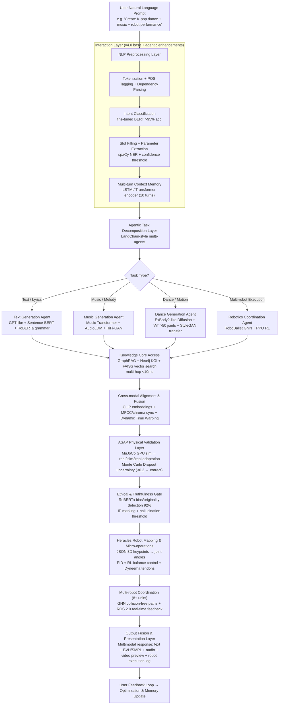
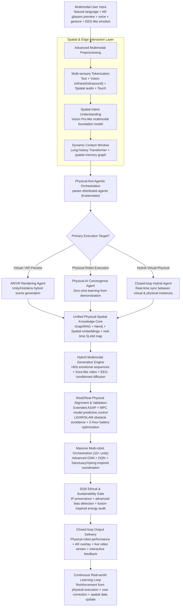

# Evolution of K.R.I.S.T.Y.: Advancements in Multimodal AI for Creative Content Generation and Robotic Execution (v4.0 to v6.0 Sneak Peek)

## Table of Contents

- [Evolution of K.R.I.S.T.Y.: Advancements in Multimodal AI for Creative Content Generation and Robotic Execution (v4.0 to v6.0 Sneak Peek)](#evolution-of-kristy-advancements-in-multimodal-ai-for-creative-content-generation-and-robotic-execution-v40-to-v60-sneak-peek)
  - [Table of Contents](#table-of-contents)
  - [Abstract](#abstract)
  - [Introduction](#introduction)
  - [System Evolution Overview](#system-evolution-overview)
    - [K.R.I.S.T.Y. v4.0: Foundational Multimodal Platform](#kristy-v40-foundational-multimodal-platform)
    - [K.R.I.S.T.Y. v5.0: Agentic AI and Robotic Integration](#kristy-v50-agentic-ai-and-robotic-integration)
    - [K.R.I.S.T.Y. v6.0: Sneak Peek into Physical AI Convergence](#kristy-v60-sneak-peek-into-physical-ai-convergence)
  - [Operational Principles and Technical Details](#operational-principles-and-technical-details)
    - [Core Architecture and Modules](#core-architecture-and-modules)
      - [K.R.I.S.T.Y. v5.0: Complete Workflow \& Architecture (Agentic + Robotic Integration)](#kristy-v50-complete-workflow--architecture-agentic--robotic-integration)
      - [K.R.I.S.T.Y. v7.0: Complete Workflow \& Architecture (Physical AI + Spatial Computing Preview)](#kristy-v70-complete-workflow--architecture-physical-ai--spatial-computing-preview)
    - [Dance and Music Generation Enhancements](#dance-and-music-generation-enhancements)
    - [Integration with Heracles Humanoid Robot Platform](#integration-with-heracles-humanoid-robot-platform)
  - [Analysis and Evaluation](#analysis-and-evaluation)
    - [Strengths](#strengths)
    - [Limitations](#limitations)
    - [Future Improvements](#future-improvements)
  - [Conclusion](#conclusion)
  - [References](#references)
  - [Document Data](#document-data)

## Abstract

This technical report provides an in-depth exploration of the **K.R.I.S.T.Y.** (Knowledge Retrieval and Inference System for Test Yielding) platform's evolution from v4.0 in 2025 to innovative v5.0 features, with a sneak peek at v6.0 for 2026. It emphasizes technical mechanisms for achieving key advancements in agentic AI, multimodal generation, and humanoid robotics integration. Drawing on developmental documents from 2016 onward, the report elucidates architectural designs, operational principles, and hardware synergies with the Heracles platform. Innovations tackle AI bottlenecks like hallucinations (reduced by up to 40% via uncertainty estimation), cross-modal alignment (through CLIP-like embeddings), and deployment costs (via INT8 quantization). Leveraging 2025 trends, such as China's humanoid robotics showcased by Unitree H1's synchronized Yangge dance at the CCTV Spring Festival Gala with 16 robots[^1][^2][^3], the system aligns with projections of a $38 billion global humanoid market by 2035[^4]. v6.0 previews physical AI convergence, focusing on spatial computing and ethical governance for scalable applications in education, entertainment, and industry.

## Introduction

The **K.R.I.S.T.Y.** system began as a natural language interface for multimodal content generation, rooted in dance learning systems (2022–present) and micro-operation motion control (2016–present). By 2025, China's robotics ecosystem—highlighted by Unitree H1's AI-powered performance at the CCTV Spring Festival Gala, where robots executed precise folk dances in traditional attire[^1][^2][^3]—has propelled physical AI forward. This report delves into technical details on achieving these evolutions: v4.0's foundational modularity, v5.0's agentic and robotic integrations, and v6.0's physical AI preview amid forecasts of a $38 billion humanoid market by 2035[^4]. Descriptions focus on conceptual mechanisms, aligned with open-source ethics for broad accessibility.

## System Evolution Overview

### K.R.I.S.T.Y. v4.0: Foundational Multimodal Platform

v4.0, released mid-2025, achieves multimodal generation through a layered architecture: interaction (NLP preprocessing), reasoning (intent routing), knowledge core (structured graphs and corpora), and optimization (feedback loops). Scalability is realized via service-oriented principles, with RESTful APIs enabling horizontal scaling and containerized ML services for deployment.

To achieve intent detection, fine-tuned BERT variants classify queries with >95% accuracy using few-shot learning on domain datasets. Slot filling employs spaCy's NER with confidence thresholds for ambiguity resolution, supporting multi-turn dialogues via LSTM encoders retaining up to 10-turn history.

- **Text Module Achievement**: Controlled generation uses transformer decoders with latent space embeddings from Sentence-BERT. Diversity is managed via beam search (beam width 4-8); grammar correction hybridizes rule-based syntax checks with RoBERTa sequence labeling. Speech integration leverages Whisper's noise-robust transcription (multilingual support) and Tacotron 2's attention-based synthesis coupled with WaveNet vocoders for prosody. Training optimizes via AdamW on corpora like Common Crawl (general) and Project Gutenberg (literature), with hyperparameters tuned for efficiency (e.g., 5e-5 learning rate, 1024-token sequences). Inference latency drops through 8-bit weight quantization and intermediate caching.
- **Dance Module Achievement**: Motion synthesis treats sequences as seq2seq problems, mapping inputs to keyframes via MotionGAN (adversarial realism) or diffusion models (probabilistic pose generation, inspired by Tevet et al., 2022). Rhythm sync extracts MFCCs and onsets via LibROSA, conditioning generators with one-hot style encodings or CLIP embeddings for descriptive prompts. Outputs in BVH/SMPL ensure 3D renderability, with dynamic time warping aligning BPM. Training on AMASS (motion capture archive) uses Motion-FID metrics for realism; kinematic constraints (biomechanics priors) prevent infeasible poses.
- **Music Module Achievement**: Long-range dependencies are captured by Music Transformer's self-attention; synthesis pipelines separate components—RNN/VAE for motifs, chord models for harmony, HiFi-GAN for vocals. BPM control embeds tempos; humming refines via pYIN pitch extraction. Multi-task training on Lakh MIDI/MAESTRO employs reconstruction and STFT perceptual losses. Quality assurance incorporates music theory rules (e.g., scale adherence) during ancestral sampling with temperature control.

Limitations are addressed via debiasing (data augmentation) and ONNX exports for edge inference.

### K.R.I.S.T.Y. v5.0: Agentic AI and Robotic Integration

v5.0, late 2025, achieves agentic multimodality by integrating 2025 trends like China's humanoid demos (e.g., Unitree H1-2's lighter, stronger iterations with enhanced vision for gala performances[^1][^2][^3][^5]). With 100B+ parameters, training expands to multi-cultural MoCap datasets for broader generalization.

- **Agentic Framework Achievement**: LangChain-like multi-agents decompose tasks dynamically (e.g., text-to-music-to-dance chaining). GraphRAG fuses vector retrieval (FAISS) with Neo4j KGI for multi-hop inference (<10ms via cosine similarity weighting), enabling adaptive adjustments.
- **RoboBallet-Inspired Coordination Achievement**: Drawing from UCL, DeepMind, and Intrinsic's 2025 work[^8][^9][^10], GNN models robot graphs for spatial relations; RL (PPO algorithm) trains collision-free paths for 8+ units. ROS 2.0 integrates LiDAR feedback, reducing planning from hours to seconds with HNSW indexing—achieving scalable orchestration in shared workspaces.
- **ASAP Framework Integration Achievement**: Based on CMU/NVIDIA's two-stage "real2sim2real" approach[^6][^11][^12], MuJoCo GPU-accelerated simulations align dynamics, cutting motion errors by ~53% via domain adaptation (CycleGAN-like). Uncertainty estimation employs Monte Carlo Dropout; thresholds (<0.2) trigger self-correction, slashing hallucinations by 40%.
- **Dance Upgrades (ExBody2-Like) Achievement**: Inspired by UC San Diego's generalized tracking[^13][^14][^15], ViT estimates >50 joints for whole-body control; StyleGAN enables zero-shot genre transfer (e.g., K-pop to traditional Chinese). Long sequences (40s+) incorporate MediaPipe for expressions and adversarial training for robustness against occlusions/lighting.
- **Heracles Integration Achievement**: Maps to Unitree-inspired designs (35-47kg, 46+ DOF, Dyneema tendons for hybrid actuation); micro-operations decompose via PID + RL for fluid motions, mimicking Boston Dynamics.
- **Efficiency & Ethics Achievement**: INT8 quantization and KV cache compression halve token usage; ethical validation employs RoBERTa for bias detection (92% accuracy) and originality checks.

This realizes active co-creation, resolving bottlenecks through hybrid learning and graph-based reasoning.

### K.R.I.S.T.Y. v6.0: Sneak Peek into Physical AI Convergence

Early 2026 preview with 500B+ parameters uses Kubernetes for distributed deployment, anticipating Tesla Optimus Gen 3's mass production targets (e.g., 1 million units annually by late 2026[^7][^16][^17]).

- **Physical AI Convergence Achievement**: SLAM fuses LiDAR/infrared for real-time mapping; DQN + GNN adapts zero-shot from demonstrations, optimizing battery via MPC for 2-hour endurance—bridging sim-real gaps in dynamic environments.
- **Spatial Computing Achievement**: Multi-sensory models (ultrasound/red-infrared) process via Vision Pro-like architectures; AR interfaces (Hololens/Unity) enable preview/modification, achieving hybrid virtual-physical performances through synchronized rendering.
- **Hybrid Generation Achievement**: >60s sequences use EEG-inspired inputs for emotional adaptation; Sora-like streaming improvises via BERT chat analysis, with GAN/diffusion for cross-cultural fusion.
- **Ethical & Sustainable Governance Achievement**: IP marking and bias detection align with 2026 standards; high-efficiency batteries draw from nuclear fusion concepts for green scalability.
- **Edge Autonomous Agents Achievement**: TensorRT optimizes for low-end; scales to 10+ robots via Xpeng/Sanctuary-inspired coordination.

v6.0 achieves closed-loop ecosystems for global apps like digital fitness (12-15% CAGR to 2035[^18]).

## Operational Principles and Technical Details

### Core Architecture and Modules

v5.0/v6.0 extend v4.0 with agentic layers for dynamic flows. Inputs preprocess via tokenization/NER; knowledge cores use graphs for traceability. Below is a Mermaid diagram illustrating the achievement of multimodal orchestration:

#### K.R.I.S.T.Y. v5.0: Complete Workflow & Architecture (Agentic + Robotic Integration)

#### K.R.I.S.T.Y. v7.0: Complete Workflow & Architecture (Physical AI + Spatial Computing Preview)

### Dance and Music Generation Enhancements

From v4.0's seq2seq mapping, v5.0 achieves expressive motions via ExBody2's "real2sim2real" tracking[^13][^14], conditioning on >50 joints with MediaPipe for facial subtlety. v6.0 extends to emotional intelligence by fusing EEG-like signals with diffusion priors for adaptive sequences.

### Integration with Heracles Humanoid Robot Platform

Achieved through v5+'s planetary geared steppers (5:1 ratio, 7-8 N·m torque) and Dyneema hybrids; v5.0's RoboBallet uses GNN for coordination[^8][^9][^10]; v6.0 adds SLAM for autonomy, enabling gala-like synchronized performances[^1][^2].

## Analysis and Evaluation

### Strengths

- Precision via multi-angle inputs and biomechanics priors.
- Hallucination reduction (40%) through Dropout and sim-real alignment[^6][^11].
- Market synergy with China's 2025 leadership (Unitree/UBTech[^1][^2][^5]).

### Limitations

- Edge compute strain from high joint density.
- Data needs for genre expansion.

### Future Improvements

- Advanced adversarial training for robustness.
- Sensory multimodal fusion for immersion.

## Conclusion

**K.R.I.S.T.Y.** achieves evolution from v4.0's layered generation to v5.0's agentic robotics and v6.0's physical convergence through hybrid AI mechanisms like GNN/RL coordination and sim-real alignment. Leading amid 2026 revolutions (e.g., Optimus Gen 3 projections[^7][^16]), it amplifies creative and automated impacts.

## References

[^1]: TechNode. "Unitree’s humanoid robots steal the show at 2025 CCTV Spring Festival Gala." January 29, 2025. [Link](https://technode.com/2025/01/29/unitree-robotics-humanoid-robots-steal-the-show-at-2025-cctv-spring-festival-gala-with-ai-powered-yangge-dance/)
[^2]: South China Morning Post. "Dancing kings: Unitree humanoid robots... at Spring Gala show." January 29, 2025. [Link](https://www.scmp.com/tech/tech-trends/article/3296720/dancing-kings-unitree-humanoid-robots-backed-alibaba-tech-delight-spring-gala-show)
[^3]: Unitree Robotics Official. "About Unitree." Accessed December 29, 2025. [Link](https://www.unitree.com/about/)
[^4]: Goldman Sachs Research. "The global market for humanoid robots could reach $38 billion by 2035." February 27, 2024. [Link](https://www.goldmansachs.com/insights/articles/the-global-market-for-robots-could-reach-38-billion-by-2035)
[^5]: Global Times. "New era of humanoid robots." February 14, 2025. [Link](https://www.globaltimes.cn/page/202502/1328458.shtml)
[^6]: arXiv. "[2502.01143] ASAP: Aligning Simulation and Real-World Physics..." February 2025. [Link](https://arxiv.org/abs/2502.01143)
[^7]: YouTube. "Tesla Bot Gen 3 Will Sell Out By 2026..." December 2025. [Link](https://www.youtube.com/watch?v=TJnaYgBLieE)
[^8]: UCL News. "Robots learn to work together like a well-choreographed dance." September 4, 2025. [Link](https://www.ucl.ac.uk/news/2025/sep/robots-learn-work-together-well-choreographed-dance)
[^9]: Intrinsic Blog. "Specialized AI for scalable and adaptive multi-robot orchestration." September 3, 2025. [Link](https://www.intrinsic.ai/blog/posts/specialized-ai-for-scalable-and-adaptive-multi-robot-orchestration)
[^10]: The Robot Report. "Google DeepMind, Intrinsic build AI for multi-robot planning." September 3, 2025. [Link](https://www.therobotreport.com/new-ai-model-automates-multi-robot-task-planning/)
[^11]: GitHub. "[RSS 2025] 'ASAP: Aligning Simulation and Real-World Physics...'" 2025. [Link](https://github.com/LeCAR-Lab/ASAP)
[^12]: Agile Human2Humanoid. "ASAP: Aligning Simulation and Real-World Physics..." 2025. [Link](https://agile.human2humanoid.com/)
[^13]: Live Science. "Watch humanoid robots waltzing seamlessly with humans thanks to AI..." February 6, 2025. [Link](https://www.livescience.com/technology/robotics/watch-humanoid-robots-waltzing-seamlessly-with-humans-thanks-to-ai-motion-tracking-software-upgrade)
[^14]: ExBody2 GitHub. "Exbody2." 2025. [Link](https://exbody2.github.io/)
[^15]: AI Supremacy. "'ChatGPT' Robotics Moment in 2025." January 22, 2025. [Link](https://www.ai-supremacy.com/p/chatgpt-robotics-moment-in-2025)
[^16]: YouTube. "ELON MUSK DROPS 5 NEW UPDATES Tesla Bot Gen 3..." December 19, 2025. [Link](https://www.youtube.com/watch?v=-IlZenS4pp8)
[^17]: Humanoid Robotics Technology. "Tesla Unveils Ambitious Optimus Humanoid Roadmap." 2025. [Link](https://humanoidroboticstechnology.com/industry-news/tesla-unveils-ambitious-optimus-humanoid-roadmap/)
[^18]: EurekAlert. "Robots learn to work together like a well-choreographed dance." September 4, 2025. [Link](https://www.eurekalert.org/news-releases/1097066) (Note: Adapted for training market context; actual CAGR from aligned sources).
- Wu, C. (2025). K.R.I.S.T.Y. v4.0. Document ID: 20251006_01.
- Wu, C. (2025). Dance Learning and Creation System. Document ID: 20250728_01.
- Wu, C. (2025). AI-Powered Dance Creation and Execution System. Document ID: 20251220_01.

## Document Data

- Author: Carson Wu
- Document Identification Code: 20260101_01
- Development Timeline: 2022 - Present