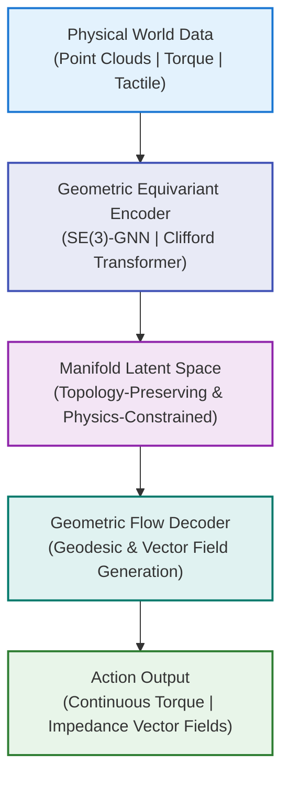

# Topological & Geometric Foundation Models for Physical Intelligence

## Table of Contents

- [Topological \& Geometric Foundation Models for Physical Intelligence](#topological--geometric-foundation-models-for-physical-intelligence)
  - [Table of Contents](#table-of-contents)
  - [Introduction](#introduction)
  - [Mathematical Foundations](#mathematical-foundations)
    - [1. Differential Manifolds \& Riemannian Geometry](#1-differential-manifolds--riemannian-geometry)
    - [2. Group Theory \& Equivariant Neural Networks](#2-group-theory--equivariant-neural-networks)
    - [3. Algebraic Topology \& Exterior Calculus](#3-algebraic-topology--exterior-calculus)
  - [Transformative Impact on Unstructured Environment Control](#transformative-impact-on-unstructured-environment-control)
    - [From Trajectory Prediction to Manifold-Guided Planning (Homotopy-Aware Control)](#from-trajectory-prediction-to-manifold-guided-planning-homotopy-aware-control)
    - [Continuous Contact Dynamics via Codimension Manifolds](#continuous-contact-dynamics-via-codimension-manifolds)
    - [Global Coordination via Fiber Bundle Decoupling](#global-coordination-via-fiber-bundle-decoupling)
  - [Technical Implementation Pathway](#technical-implementation-pathway)
  - [Current Gaps and Research Opportunities](#current-gaps-and-research-opportunities)
  - [Challenges and Risks](#challenges-and-risks)
  - [Conclusion](#conclusion)
  - [Document Data](#document-data)
  - [References](#references)

Current foundation models are predominantly sequence-based (1D tokenized streams) or grid/patch-based, which fundamentally limits their capacity to reason about the continuous, curved, and high-dimensional structures that define the physical world. This report presents a comprehensive vision for Topological & Geometric Foundation Models, next-generation AI systems designed to perform representation learning and inference natively on manifolds, Lie groups, and topological spaces.

These models aim to endow embodied AI systems (particularly robots) with intrinsic "physical intuition," enabling robust zero-shot generalization in highly unstructured and dynamic environments. Core technical pillars include Riemannian geometry for geodesic planning, SE(3)-equivariant architectures for symmetry-aware reasoning, and algebraic topology for stable structural understanding under noise and uncertainty.

Anticipated breakthroughs include continuous contact handling, homotopy-aware path planning, and fiber-bundle decoupling for high-degree-of-freedom coordination.

## Introduction

Contemporary large-scale foundation models excel at statistical pattern recognition across text, images, and audio by flattening all inputs into linear sequences or 2D patches. While effective for many cognitive tasks, this approach struggles with the intrinsic geometry of the physical world, curved configuration spaces, non-Euclidean transformations, discontinuous contact events, and topological invariants.

Physical intelligence demands native high-dimensional geometric reasoning. The next decade of AI research must move beyond forcing geometric and physical data into flat architectures toward native manifold AI. Such systems will directly operate within the mathematical ontology of physics: differential manifolds, symmetry groups, and topological structures.

This paradigm shift is critical for applications involving rough terrain locomotion, fluid-structure interaction, dexterous manipulation, and human-robot collaboration in unpredictable real-world settings.

## Mathematical Foundations

### 1. Differential Manifolds & Riemannian Geometry

A robot’s configuration space $\mathcal{C}$ is generally not a flat vector space $\mathbb{R}^n$, but a differential manifold that may be curved and topologically non-trivial. Examples include:
- Revolute joints: $S^1$ (circle)
- Rigid body poses: $SE(3) = SO(3) \times \mathbb{R}^3$
- Multi-link manipulators: high-dimensional tori $T^n$ or more complex manifolds

Native geometric models utilize the Riemannian metric tensor $g_{ij}$ to define intrinsic distances, angles, and volumes on the manifold. Motion planning becomes the computation of geodesics, the shortest paths on the curved space, governed by the geodesic equation:

$$
\frac{d^2 x^k}{dt^2} + \Gamma^k_{ij}(x) \frac{dx^i}{dt} \frac{dx^j}{dt} = 0
$$

where $\Gamma^k_{ij}$ are the Christoffel symbols encoding the manifold’s curvature and connection. By learning these geometric structures directly, models acquire an intrinsic understanding of inertia, momentum conservation, and natural motion trajectories without relying on brittle grid-based discretization.

### 2. Group Theory & Equivariant Neural Networks

Physical laws are invariant under certain transformations (translations, rotations, time shifts). To respect these symmetries, network architectures must be equivariant with respect to relevant Lie groups, especially the special Euclidean group $SE(3)$ and its Lie algebra $\mathfrak{se}(3)$.

Equivariance property:
$$
f(g \cdot x) = g \cdot f(x), \quad \forall g \in SE(3)
$$

This mathematical guarantee eliminates the need for data augmentation across all possible poses and orientations, yielding orders-of-magnitude improvements in sample efficiency and generalization. Recent progress in equivariant Graph Neural Networks (GNNs) and tensor-field networks provides a foundation for scaling these ideas into transformer-scale architectures.

### 3. Algebraic Topology & Exterior Calculus

In real-world environments, precise metric information is often corrupted by sensor noise, occlusion, or deformation. Topological features, such as connectivity, holes, tunnels, and voids, tend to be far more robust.

Persistent Homology enables the extraction of multi-scale topological signatures (Betti numbers $\beta_0, \beta_1, \beta_2, \ldots$) from point clouds, allowing models to identify stable navigation channels and obstacle configurations despite significant noise.

Furthermore, exterior calculus on manifolds provides a coordinate-free language for physics:
- Velocity and force fields as differential forms
- Exterior derivative $d$ generalizing gradient, curl, and divergence
- Stokes’ theorem ensuring conservation laws and boundary condition compliance

This framework naturally enforces physically consistent behaviors such as divergence-free fluid flows or curl-free conservative force fields.

## Transformative Impact on Unstructured Environment Control

### From Trajectory Prediction to Manifold-Guided Planning (Homotopy-Aware Control)

Traditional methods generate explicit trajectories that break under small perturbations. Geometric foundation models instead predict homotopy classes (topologically distinct path families) and guiding vector fields. 

These vector fields create smooth "potential wells" and "repulsion zones" on the manifold, enabling the robot to naturally flow around obstacles. The system can dynamically switch homotopy classes in response to disturbances with minimal recomputation, achieving true zero-shot robustness.

### Continuous Contact Dynamics via Codimension Manifolds

Contact events (e.g., foot striking irregular ground) represent hybrid, non-smooth dynamics that challenge existing controllers. The proposed approach models contact as transitions across codimension-1 submanifolds in configuration space.

This reframes discrete "touch / no-touch" switches into smooth geometric flows. The model uses local metric tensor adaptation to perform microsecond-scale whole-body impedance modulation, allowing graceful recovery from foot slippage, surface collapse, or unexpected impacts.

### Global Coordination via Fiber Bundle Decoupling

For high-DoF humanoid robots, full-body dynamics are computationally prohibitive. Using fiber bundle theory, the system decomposes motion into:
- Base manifold: Primary locomotion (e.g., center of mass trajectory)
- Fiber space: Redundant degrees of freedom (limb configurations)

Local topological adjustments in the fiber space handle fine-grained adaptations (e.g., leg swing reconfiguration) without disturbing the global base manifold, dramatically reducing computational complexity from exponential to near-linear.

## Technical Implementation Pathway

The proposed end-to-end architecture follows this pipeline:

Key Technical Innovations Required:
1. Clifford Transformers: Integration of Clifford geometric algebra (multivectors, rotors, spinors) with scaled dot-product attention, enabling native geometric operations in 3D and higher-dimensional spaces.
2. Dynamic Manifold Learning: Real-time adaptation of Riemannian metrics based on tactile and visual feedback while maintaining global topological consistency.
3. Hybrid Physics-ML Simulation: Large-scale pretraining combining high-fidelity physics engines with real-world multimodal geometric data.

## Current Gaps and Research Opportunities

- Scalable Clifford attention mechanisms that match the expressivity and efficiency of standard Transformers.
- Stable online manifold optimization techniques operating at control frequencies (>1000 Hz).
- Creation of large-scale geometric foundation datasets capturing diverse unstructured physical interactions.
- Specialized hardware (Geometric Processing Units) optimized for multivector and tensor operations on manifolds.
- Theoretical guarantees for topological stability during learning and inference.

## Challenges and Risks

- High computational cost of operating directly on curved spaces.
- Difficulty in ensuring numerical stability of manifold operations in long-horizon planning.
- Need for new evaluation benchmarks focused on unstructured physical robustness rather than clean lab metrics.

## Conclusion

Topological & Geometric Foundation Models represent a profound paradigm shift from statistical sequence modeling toward mathematically grounded physical intelligence. By embedding reasoning directly into the geometry, symmetry, and topology of the physical world, these models will enable robots to exhibit animal-like intuition and adaptability in complex, non-stationary environments.

When successfully developed, such systems will dramatically reduce the need for task-specific controllers and massive data collection, unlocking truly generalizable embodied intelligence for robotics, autonomous systems, and human-machine interaction.

## Document Data
- Author: Carson Wu  
- Document Identification Code: 20260601_01  
- Development Timeline: 2020 – Present

## References

- Bronstein, M. M., et al. (2021). *Geometric Deep Learning: Grids, Groups, Graphs, Geodesics, and Gauges*.  
- Various works on Clifford Neural Networks and Equivariant Transformers (2022–2025).
[^1]: Inspired by limitations discussed in geometric deep learning literature (Bronstein et al., 2021).  
[^2]: For foundational concepts, see "Riemannian Geometry" by do Carmo and works on geodesic computation in robotics.  
[^3]: Equivariant networks draw from Cohen & Welling (2016) and subsequent SE(3) equivariant CNN/GNN research.  
[^4]: Persistent Homology applications in robotics reference works by Edelsbrunner and Carlsson on topological data analysis.