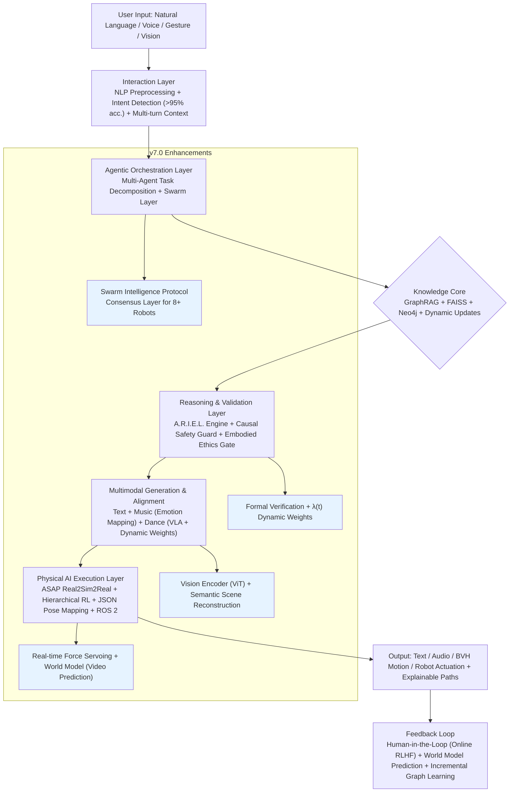

# K.R.I.S.T.Y. v7.0

## Table of Contents

- [K.R.I.S.T.Y. v7.0](#kristy-v70)
  - [Table of Contents](#table-of-contents)
  - [Abstract](#abstract)
  - [System Overview](#system-overview)
  - [Features and Capabilities](#features-and-capabilities)
  - [Usage Instructions](#usage-instructions)
  - [Applications](#applications)
  - [Future Improvements](#future-improvements)
  - [Document Data](#document-data)
  - [References](#references)

## Abstract

K.R.I.S.T.Y. v7.0 represents the culmination of a decade-long evolution from an early knowledge-base chatbot (originating as A.B.C. v1.0 in 2016) into a fully embodied, multimodal physical AI platform. It integrates advanced retrieval-augmented generation (RAG), GraphRAG multi-hop reasoning, agentic orchestration, and real-time robotic control for humanoid platforms such as the Heracles system.  

Building on v4.0–v6.0 foundations, v7.0 introduces enhanced emotional alignment, swarm intelligence for multi-robot coordination, human-in-the-loop correction via Online RLHF, causal safety guards, and a dynamic Vision-Language-Action (VLA) model. These advancements enable seamless transformation of natural language intent into synchronized text, music, dance, and physical robotic execution while maintaining high fidelity, safety, and explainability. The system complements Transformer architectures by providing external knowledge constraints, physical alignment, and causal reasoning, significantly reducing hallucinations and motion errors.

## System Overview

K.R.I.S.T.Y. employs a layered, modular architecture that fuses natural language processing, knowledge retrieval, multimodal generation, and physical execution. The core operator is defined as:

$$\Omega(Q) = \text{Execution} \left( \text{Reasoning}( \text{Retrieve}(Q, \mathcal{K}) \oplus \text{LLM}(Q) ) \right)$$

where $Q$ is the user query/intent, $\mathcal{K}$ is the hybrid knowledge base (vector + graph), and execution spans digital content to robotic actuation.

## Features and Capabilities

**Core Inherited Capabilities (v4.0–v6.0 Foundation)**:
- **Multimodal Generation**: Text (controlled generation + grammar correction), Music (melody/humming synthesis with long-range dependencies), Dance (MotionGAN/diffusion models synchronized via BPM and Dynamic Time Warping).
- **Knowledge & Reasoning**: A.R.I.E.L. engine for RAG, GraphRAG for multi-hop inference (<10ms latency), knowledge graph traceability.
- **Physical Robotics**: Integration with Heracles humanoid (46+ DOF), ASAP real2sim2real framework (motion error reduction ~53%), hierarchical RL for balance-priority dance execution (55–60 effective keypoints).
- **Agentic & Multi-Robot**: Multi-agent task chaining, collision-free planning for 8+ units.

**Key v7.0 Advancements**:
1. **Emotional Melody Mapping**: Analyzes musical emotional valence (e.g., major/minor keys) via an Emotion_Gate to modulate dance amplitude and style for affective consistency.
2. **Multi-Agent Swarm Collaboration**: Swarm Layer with role assignment (lead/follower) via knowledge graph for complementary group choreography.
3. **Human-in-the-Loop Correction**: Real-time voice interventions via Online RLHF and LoRA fine-tuning.
4. **Causal Safety Guard & Embodied Ethics Gate**: Formal verification against torque limits and harm assessment; interrupts unsafe commands.
5. **Dynamic Weight Alignment & λ(t)**: Cross-attention for spatial-semantic fusion; task-adaptive balancing between creativity and precision.
6. **Vision-Language-Action (VLA) Model**: ViT vision encoder for direct imitation learning from camera feeds.
7. **World Model & Predictive Safety**: Video prediction for 2-second future simulation to preempt falls/collisions.
8. **Incremental & Distributed Learning**: Dynamic GraphRAG updates, semantic scene reconstruction (LiDAR + semantics), spatial continuity across devices.
9. **Explainable Reasoning Paths**: Visualizes GraphRAG traversal for industrial trust.
10. **Advanced Perception**: Multi-target CNN detection, depth prediction with occlusion handling, and semantic reconstruction for safe interaction.

## Usage Instructions

1. **Input**: Provide natural language prompts (text/voice), reference media (music/humming/video), or visual demonstration via camera.
2. **Invocation**: System routes intent through the orchestrator. Example: "Generate an emotionally uplifting K-pop group dance for 4 Heracles robots synchronized to [music clip]."
3. **Generation & Execution**:
   - Preview digital outputs (text, audio, BVH animation).
   - Deploy to robot(s) via ROS 2 with real-time JSON pose streaming.
   - Intervene verbally during execution for corrections.
4. **Monitoring**: Access explainable paths, safety logs, and performance metrics via dashboard.
5. **Deployment**: Supports edge (ONNX/INT8), cloud, and hybrid setups. Containerized microservices for scalability.

Safety protocols (balance priority, ethics gate) activate automatically.

## Applications

- **Creative Industries**: Automated music-dance content production, virtual/physical performances.
- **Education & Training**: Personalized dance learning with real-time feedback and robotic demonstration.
- **Industrial & Logistics**: Precise multi-robot coordination with causal safety (e.g., assembly, warehouse).
- **Entertainment & Events**: Synchronized humanoid performances (inspired by 2025 Unitree gala demos).
- **Healthcare & Therapy**: Emotionally attuned movement guidance.
- **Research**: Embodied AI experimentation with explainable, verifiable physical reasoning.

## Future Improvements

- Further scaling of swarm intelligence for dozens of units with advanced consensus protocols.
- Integration of richer sensory modalities (tactile, EEG-inspired emotion).
- Enhanced zero-shot generalization across cultures and environments via larger multimodal datasets.
- Optimization for energy efficiency and sustainable deployment.
- Broader standardization and open-source contributions for community-driven expansions.

## Document Data

- Author: Carson Wu  
- Document Identification Code: 20260609_01  
- Development Timeline: 2026 – Present

## References
- Wu, C. (2025). *K.R.I.S.T.Y. v4.0*. Document Identification Code: 20251006_01.
- Wu, C. (2026). *Evolution of K.R.I.S.T.Y.: Advancements in Multimodal AI for Creative Content Generation and Robotic Execution (v4.0 to v6.0 Sneak Peek)*. Document Identification Code: 20260101_01.
- Wu, C. (2026). *Real‑Time Dance Motion Capture and Robotic Execution with Reinforcement‑Learning Control*. Document Identification Code: 20260519_01.
- Wu, C. (2025). *Dance Learning and Creation System*. Document Identification Code: 20250728_01.